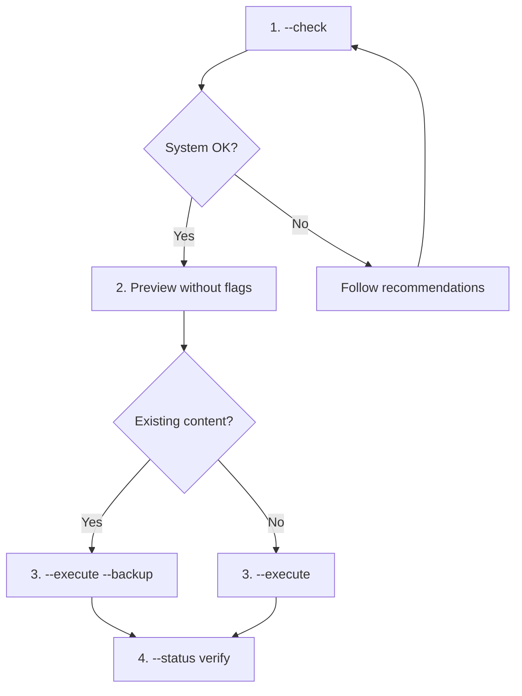

# Sync Claude Config

Creates symlinks (or junctions on Windows) in `~/.claude/` pointing to `poneglyph/.claude/`, allowing skills/agents/commands/rules to be used in any project.

The generated user profile comes from `.claude/settings.global.json` plus the
ignored `.claude/settings.machine.json` overlay. The repository's
`.claude/settings.json` is intentionally project-scoped and contains no global
hooks, preventing duplicate hook registration while developing Poneglyph.

`--validate-hooks` checks that every hook registered in the generated `~/.claude/settings.json` resolves to a real file in the synced layer (run it after `--execute` when hooks changed).

`--execute` and `--status` also run `claude doctor` on the generated `~/.claude/settings.json` and read its "Invalid settings" section (032/WP1): a rejected file fails the sync with exit 1 and, with `--backup`, the previous file is put back. Headless `claude -p` never surfaces that error, and Claude Code skips a rejected settings file ENTIRELY (hooks, permissions, style) — the audit-010 regression. `--no-validate` skips the check on machines without the CLI.

## Multi-OS Compatibility

| OS | Default method | Required permissions |
|----|----------------|----------------------|
| Windows | Junction | None |
| Windows (Dev Mode) | Symlink | Developer Mode ON |
| macOS | Symlink | User permissions |
| Linux | Symlink | User permissions |

## Recommended Workflow



## Usage

### 1. Verify system (recommended first)

```bash
bun .claude/commands/sync-claude.ts --check
```

Shows OS/version, admin/root status, Developer Mode (Windows), whether symlinks/junctions can be created, plus recommendations if anything is missing.

### 2. Preview changes

```bash
bun .claude/commands/sync-claude.ts
```

### 3. Run sync

```bash
# Normal (use --backup if any dest dir already exists, e.g. ~/.config/ccstatusline)
bun .claude/commands/sync-claude.ts --execute --backup

# Without backup (only if all destinations are new)
bun .claude/commands/sync-claude.ts --execute

# Force a specific method
bun .claude/commands/sync-claude.ts --method junction --execute
```

### 4. View current status

```bash
bun .claude/commands/sync-claude.ts --status
```

### 5. Undo (remove symlinks)

```bash
bun .claude/commands/sync-claude.ts --unlink
```

## CLI Options

| Option | Description |
|--------|-------------|
| `--check` | Verify system and permissions |
| `--status` | Show current status |
| `--execute` | Apply changes |
| `--backup` | Save existing content before replacing |
| `--unlink` | Remove symlinks |
| `--method` | Force method: `auto`, `symlink`, `junction`, `copy` |
| `--force` | Do not prompt for confirmation |
| `--no-validate` | Skip the `claude doctor` acceptance check of the generated settings.json |

## Linking Methods

| Method | Advantages | Disadvantages |
|--------|------------|---------------|
| `symlink` | Standard, works with files and folders | Windows: requires Dev Mode or Admin |
| `junction` | Windows: no special permissions | Folders only, Windows only |
| `copy` | Always works | Does not sync changes |

## Synced Folders

| Folder | Contents |
|--------|----------|
| `skills/` | Reusable skills |
| `commands/` | Slash commands |
| `rules/` | Behavior rules |
| `docs/` | Technical documentation |
| `hooks/` | Automations |
| `workflows/` | Saved Workflow scripts |
| `output-styles/` | Output style modes (e.g. Poneglyph) |
| `plans/templates/` | `/flow` document templates — the global fallback the phase skills read outside poneglyph (`~/.claude/plans/templates/`) |
| `CLAUDE.md` | Global instructions |

> `agents/`, `orchestrator/` and `knowledge/` were removed from the sync list 2026-06-11 — the directories no longer exist (custom agents cut in feature 008).

## External Links (outside `~/.claude/`)

| Dest | Source | Notes |
|------|--------|-------|
| `~/.config/ccstatusline/` | `.claude/ccstatusline/` | ccstatusline widget config — symlink (macOS) / junction (Windows). Parent `~/.config/` is created if absent. |

## NOT Synced (project-specific)

| Folder | Reason |
|--------|--------|
| `agent_docs/` | Project-specific docs |
| `experts/` | Learned expertise |
| `plans/` (except `templates/`) | Project-local `/flow` lifecycles; `~/.claude/plans/` itself is Claude Code's plan-mode store and is never replaced |
| `metrics/` | Session metrics |

## Troubleshooting

### Windows: Developer Mode

If `--check` shows Developer Mode disabled (and symlinks unavailable):

1. **Option A**: Enable Developer Mode → Settings → Privacy & Security → For developers → Developer Mode: ON → restart terminal.
2. **Option B**: Use junction (default). Junctions work without special permissions; `--method junction` is automatic when symlink is unavailable.
3. **Option C**: Run terminal as Administrator.

### macOS: Permissions

```bash
ls -la ~                # Check home permissions
chmod 755 ~/.claude     # Fix if needed
```

### Linux: Permissions

```bash
ls -la ~/.claude
sudo chown -R $USER:$USER ~/.claude
```

### Symlink Conflicts

```bash
bun .claude/commands/sync-claude.ts --status            # See where they point
bun .claude/commands/sync-claude.ts --execute --backup  # Replace with backup
```

---

**Version**: 2.2.0 (2026-06-01 — added external ccstatusline config link: `~/.config/ccstatusline` ← `.claude/ccstatusline`)
