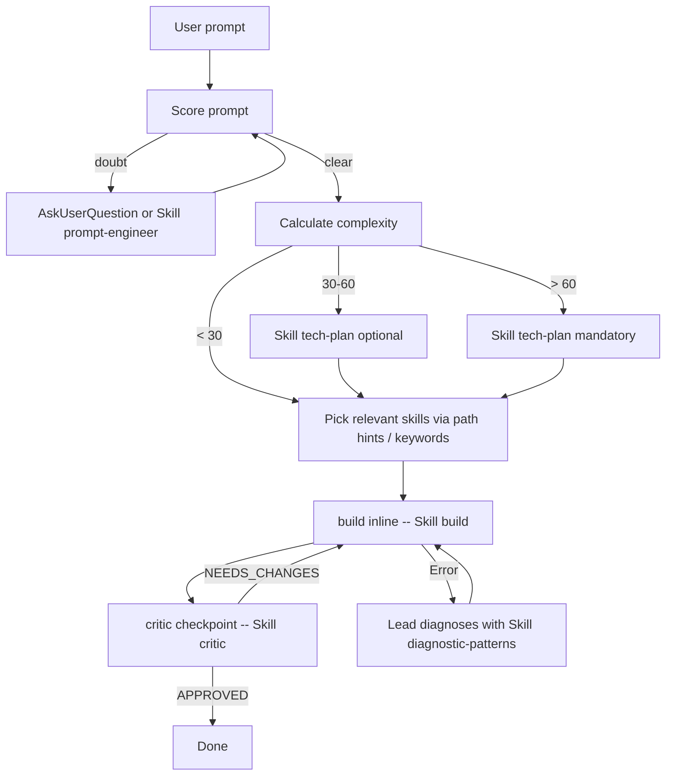

# System inventory & operational detail (evicted from CLAUDE.md — feature 017)

On-demand reference. CLAUDE.md keeps only always-needed behavior; everything here is data, history or detail recoverable with a Read. Last full update: 2026-06-11. Last pass: 2026-09-03 (plan 032 — polish: private plugin, single-owner gates, skill diet, doctor + budget ratchet; after audit 010 on 2026-09-02; do not treat the June date as current).

## Sync working model (full detail)

The intended normal case is working in **another** project while poneglyph runs underneath through `~/.claude/`. Install once per machine:

```bash
bun .claude/commands/sync-claude.ts --execute --backup --force
```

- Links `skills/commands/rules/docs/hooks/output-styles/workflows/scripts` into `~/.claude/` (authoritative folder list = `LINK_FOLDERS` in `commands/sync-claude.ts`; rules link per-entry, with `test-policy.md` excluded from the global layer — 021 decision; scripts synced since 027/US2) (junctions on Windows — no admin; symlinks on macOS/Linux) and regenerates `~/.claude/settings.json` from `settings.global.json` deep-merged with `settings.machine.json` (gitignored, per-machine), then validates the result with `claude doctor` ("Invalid settings" section; 032/WP1) — a rejected file fails the sync and the backup is restored.
- **macOS**: also create `.claude/settings.machine.json` carrying that machine's `env.PATH` — the GUI app launches with a minimal PATH, so linking alone leaves hooks/statusline broken; the PATH overlay fixes it (separate cause from linking).
- **Scope boundary**: the global (`~/.claude/skills`, link → repo) and project (`./.claude/skills`, real) paths expose the same skills, which Claude deduplicates by name. Only the user profile registers hooks; `.claude/settings.json` is hook-free, so a Poneglyph maintenance session cannot double-fire them.
- Settings load at session start → a fresh sync takes effect on the NEXT session.
- **Preserve machine plugin activation in the ignored overlay**: `claude plugin install` / `marketplace add` update `~/.claude/settings.json`, which the next sync regenerates. Shared defaults belong in `settings.global.json`; private opt-in and its marketplace belong in `.claude/settings.machine.json` under `enabledPlugins` and `extraKnownMarketplaces`. Install the reviewed private addon once per opted-in machine and verify its actual cache revision. Work exposes unique skills and private memory; its retired SessionStart hook must not remain in the installed cache.
- **Windows**: `CLAUDE.md` is **copied**, not linked (junctions can't link files) → re-run the sync after editing it or the global copy goes stale. On macOS it is a symlink (verified 2026-06-10).

## System-prompt channel (multi-host) — plan indexed-nebula, 2026-08-18

**`.claude/output-styles/poneglyph.md` is the communication-law SSOT** (v3, 2026-08-18) — Oriol's primary document, edit THIS one; Claude Code reads it live through the folder symlink. Contents: Purpose / Truth / Glance (BLUF + **cierre visual**: answers longer than one screen end with a one-line `**Resumen**`) / Voice / Cost / Referencias (Spanish codes: D decisiones · O opciones · H hallazgos · R riesgos · P preguntas · A acciones) / Límites (ask before unplanned actions; dev loop+skill routing+drillme live in CLAUDE.md; 10 Commandments + Golden Rule) / Aliases (8: corto·foco·refs·seguro·resume·opciones·explica·dudas) / Ejemplos (6 pairs). `system-prompts/poneglyph-sp.md` is the body-only twin **GENERATED by sync-claude** (frontmatter stripped, no marker — clean body) consumed by the grok symlink, sync-codex's concat, and compare.ts — never edit it by hand; after editing the style, re-run sync-claude (twin) + sync-codex (AGENTS.md). Compare harness: `.claude/evals/compare.ts` (presets + `--probes` adherence battery).

**Evidence dossier (2026-08-18)**: style = surgical system-prompt edit, adherence ≥ append (Anthropic maintainer ranking in issue #10671 puts `--append-system-prompt` weakest; deprecation attempted and reversed "indefinitely"); our probe battery 4/4 both channels; dupe = innocuous but useless (+~10K input/session); size 25-500 lines has NULL adherence effect and the real degrader is within-session decay, ~-5.6% odds per generated function (arXiv 2605.10039); subagents inherit NEITHER channel (forks do).

| Host | Channel | Freshness | Install / verify |
|---|---|---|---|
| Claude Code (any model) | `outputStyle: "Poneglyph"` (settings, always-on) — the PRIMARY channel. `--append-system-prompt-file <sp>` is measurement/belt only | live | Adapter regenerates on every `sync-claude --execute`. Known gaps: VS Code extension may not load custom styles (#39331); subagents don't inherit |
| Orca (agents it spawns) | Inherits `~/.claude/settings.json` outputStyle — **decision 2026-08-18: NO append in Argumentos** (double-load measured useless) | live | `bun .claude/scripts/sync-orca.ts` — informative: 🟢 when no append is configured, 🟡 double-load warning if one appears |
| Codex / OpenAI | `$CODEX_HOME/AGENTS.md` is generated from CLAUDE.md, the style twin and shared runtime contract. Core skills are linked; command entrypoints and native hooks are generated. Account links to matching doctrine are preserved. The adapter retains its 32 KiB instruction budget. | Re-sync changed sources; update a shared target before linked profiles. Native hooks need `/hooks` trust. | `bun .claude/scripts/sync-codex.ts --execute --backup --force` |
| Grok Build | Claude compatibility supplies doctrine, rules, skills and commands. The generated style twin is installed once. Inherited Claude hooks remain disabled; native hooks adapt the shared logic. | Links are live; Windows copies require sync. Inspect native discovery separately. | `bun .claude/scripts/sync-grok.ts --execute --backup --force`; verify with `grok inspect` |

**Claude Code wrapper** (manual launches outside Orca; optional — Orca covers spawned agents):

```bash
# zsh (~/.zshrc)
claude() { ~/.local/bin/claude --append-system-prompt-file \
  "<repo>/.claude/system-prompts/poneglyph-sp.md" "$@"; }
```

```powershell
# PowerShell ($PROFILE)
function claude { & "$env:USERPROFILE\.local\bin\claude.exe" --append-system-prompt-file `
  "<repo>\.claude\system-prompts\poneglyph-sp.md" @args }
```

**A/B comparator** (run OUTSIDE a sandboxed session): `bun .claude/evals/compare.ts "<prompt>" [--preset sp|stock|style-vs-sp|dupe] [--runs N] [--tools] [--dry-run]`. `stock` uses `--bare` (whole layer off) and needs `ANTHROPIC_API_KEY`. Markers are descriptive per side, never a suite verdict.

## Entry points → how each routes to the workflow & skills

Poneglyph has ONE workflow (the 5 phases + Lead turn flow); what differs is how you enter it. Skill activation is **layered** and the entry point decides which layers fire:

| Entry point | What it is | Phase routing | Skill activation |
|---|---|---|---|
| **Plain prompt** (`haz X`) | Normal turn | Lead triages complexity → invokes phase skills / `/flow` as needed | `skill-activation.ts` injects `Skill()` on keyword match **+** Lead self-matches via `orchestrator-protocol §05` on non-trivial work |
| **`/flow <task>`** | The **router** — feature lifecycle orchestrator | Deterministic: triages mode → runs phases 1-5 with hard gates, **invoking each phase skill explicitly** | Wired by `/flow` itself (phase→skill is hard-coded in the command); hook skips `/flow` (no double-routing) |
| **`/goal <condition>`** | Built-in **persistence loop** (Stop hook) — keeps the Lead working until the condition holds. NOT a router | None by itself — the Lead routes each turn via the always-loaded CLAUDE.md core | Hook skips it (like every slash command). `/goal` runs as the **Lead**, not a fresh-context agent: it already has the always-loaded routing core and can invoke any `Skill()` itself — it needs no injected hint. Whether the Lead *actually* loads the relevant skill on a work turn is a discretionary call (no enforcement); for guaranteed skill use, wrap the work in `/flow` |
| **`/role <name>`** | Persona-framing over existing skills | Composes skills for the role; Lead still triages | Hook skips it (role self-composes); Lead matches within the persona |

**The honest answer to "siempre activar las skills":** activation is layered:
1. **Routing core is always-loaded** (CLAUDE.md §Operating rules — Skill routing — + §Dev workflow incl. §Agents for cheap reads). The Lead therefore triages and routes on EVERY turn — including every `/goal` loop turn — without any hook. This is the real "always-on" layer.
2. **`/flow` → deterministic phase→skill wiring** (each phase invokes its skill explicitly). The strongest guarantee, for feature-shaped work.
3. **Keyword hook → on-demand skill acceleration** — best-effort, plain prompts only (skips slash commands); surfaces a specific skill (`security-audit`, `tdd-design`…) earlier than the Lead might. NOT a guarantee (Spanish/novel phrasings miss; and the Lead may ignore the hint).

**The real gap (named honestly):** skill *use* by the Lead is discretionary — the hook only nudges, CLAUDE.md only says "match skills before build", and the Lead can (and does) skip both on a given turn. On conversational/meta turns skipping is correct (loading a skill would be ceremony); the concern is genuine work turns. **The only deterministic enforcement of skill use is `/flow`** (each phase invokes its skill explicitly). So: for a real feature, wrap it in `/flow` even from inside a `/goal` loop. Don't try to force skill use via hooks/always-loaded — that's the regression pattern (Cmd IX: always-loaded content costs every turn).

## Lead turn flow (was "Mandatory flow" mermaid)



Canonical per-turn checklist: `orchestrator-protocol` skill §1.

## Execution modes

| Mode | When | Cost |
|------|------|------|
| **Inline** (default) | Build/write by default; an explicitly approved `orca-workflow` team uses the bounded shared-worktree exception | 1x |
| **Workflow read-only fan-out** | ≥4 independent read-only units (research sweeps, decision-review panels) | scales w/ agent count |
| **Workflow write fan-out** | explicit user opt-in only ("ultracode" / direct ask; "workflow" keyword no longer triggers since CC 2.1.160); per-unit `isolation: 'worktree'` on collision | scales |
| **Tiered** | Complexity 45-60 with 2-3 domains sharing interfaces — contracts inline via tech-plan Mode B | ~2x |
| **Team agents** (experimental) | Complexity >60, 3+ independent domains, interface negotiation, `CLAUDE_CODE_EXPERIMENTAL_AGENT_TEAMS=1` | 3-7x |

> **Background sessions / agent-view** (`claude agents`, CC ≥2.1.139 — version-specific, verify): orthogonal axis — runs whole **sessions** in the background with a dashboard for running/blocked/done. `claude --bg` / `←←` to background; `/resume` lists them. Operational tool, not a per-turn routing mode.

## Planner adaptive levels (tech-plan)

| Level | When | Refs loaded | Target cost |
|------|------|-------------|-------------|
| **Quick** | complexity <30 or clear scope (1-2 files, no external research) | ≤2 | ~3-5 min |
| **Standard** (default) | complexity 30-60 or some ambiguity about dependencies | 3-5 | ~10 min |
| **Full** | complexity >60, multi-domain, plan mode with architectural risk | all | ~20-30 min |

Escalation: Quick → Standard on uncertainty → Full on multi-domain/architectural risk. Level declared in the first line of planner output.

## /flow adaptation per mode

| Mode | Phases executed | When |
|---|---|---|
| `minimal` | Phase 3 direct + Phase 4 light | trivial task, 1-2 files, no design decisions |
| `standard` (default) | All 5 phases, drillme normal | feature 2-5 files OR single domain |
| `full` | All 5 phases + decide (heavy tier) in Phase 2 + fresh-context reviewer (critical-area focus; panels = decisions only, feature 019) in Phase 4 + Commandments forensics in Phase 5 | architectural / multi-domain / auth-payments-security |

## Skill loading into a Workflow agent (3 mechanisms)

1. **`skills:` frontmatter** preloads full SKILL.md at spawn — for a custom `agentType` that ALWAYS needs a skill.
2. **`Skill` tool** — an agent whose `tools:` include `Skill` self-invokes task-specific skills mid-task (CC ≥2.1.133 — verified in `.claude/plans/_research-skill-activation-2026-06-09.md`). Name the relevant skills in the task prose.
3. **Arch H — Lead-Directed Skill Reads** (fallback): embed up to 3 `Read .claude/skills/<name>/SKILL.md` instructions in the `[RELEVANT SKILLS FOR THIS TASK]` block. Lead-side `Skill()` does NOT propagate to spawned agents.

Full template and propagation model: `orchestrator-protocol/references/06-context-arch-h.md`.

## Key rules mapping (historical — old rule → current location)

| Old rule | Current location |
|---|---|
| `lead-orchestrator.md` | `.claude/skills/orchestrator-protocol/SKILL.md` |
| `orchestration-checklist.md` | `orchestrator-protocol/references/01-verification.md` |
| `prompt-scoring.md` | `prompt-engineer` skill (post-2026-05-28) |
| `complexity-routing.md` | `orchestrator-protocol/references/03-complexity-routing.md` |
| `agent-selection.md` | `orchestrator-protocol/references/04-agent-selection.md` |
| `context-management.md` | `orchestrator-protocol/references/06-context-arch-h.md` |
| `delegation-recovery.md` | `.claude/rules/error-recovery.md` |
| `output-style baseline` | `.claude/output-styles/poneglyph.md` |

## When to use rules vs skills (project level)

| Content type | Mechanism | Why |
|---|---|---|
| **Constraint** — violation blocks merge, must ALWAYS be visible | **Rule** (always-on) | e.g., "features cannot import from other features" |
| **Knowledge/guidance** — useful when relevant, not every prompt | **Skill** (on-demand) | e.g., naming conventions, function design patterns |

Test: "does the agent need this in EVERY prompt?" — no → skill.

## When to use a command vs a skill (same layer, different trigger)

**Default to a skill.** Reach for a command only for (a) a script entrypoint (`sync-claude.ts`) or (b) a pure prompt-macro that orchestrates skills with `$ARGUMENTS`/`allowed-tools` (`flow`, `role`). Command = user invokes `/x [args]` explicitly; skill = model auto-invokes on keyword/description match (no `$ARGUMENTS`). A command may invoke skills; a skill never needs `$ARGUMENTS`. Live commands: `flow`, `role`, `sync-claude` — everything else is a skill.

## Component inventory

| Component | Audit baseline (early 2026) | Post-cleanup (2026-05-28) | Current | Detail |
|---|---|---|---|---|
| Agents | 7 + 1 meta | 3 | **0 custom** | builder/reviewer/scout cut in feature 008; work runs inline (delegation doctrine), read-only fan-out via Workflow/`Explore`. The ONE sanctioned single-agent dispatch is critic's fresh-context reviewer (P1 exception, feature 019) — ad-hoc, no agent file |
| Skills | 28 | 14 | **count `ls .claude/skills`** (30 snapshot 2026-08-06) | 6 phase skills + `drillme` + `html-report` (003); 031: `best-of-n` + `project-onboard` CUT, `decision-stress-test` MERGED into `decide` (heavy tier), `escalate`→`unstuck`, `codex-consult`→`consult` (multi-model), +`pr-review` (new); `skill-advisor` restored in 023, auto-invoke-the-obvious since 031 |
| Hooks | 15+ | 6 | **the ones `settings.global.json.hooks` registers** (5 handlers over 4 events, snapshot 2026-09-09/037 — `bash-output-shaper` added: second PreToolUse/Bash handler, denies whole-file dumps and bounds unbounded listings, after tool output measured at 56 % of context; `headless-model-gate` added 033 after 82 headless sessions on Opus/Fable in one day; `post-compact` cut: CLAUDE.md reloads on compaction; `workspace-hint` moved to the private plugin `poneglyph-work`; earlier: `auto-approve` + `session-start-plans` cut 2026-08-07, `code-validator` + `learning-inbox` cut in 030) | authoritative list = user profile source; event table with per-hook detail: `rules/paths/hooks.md` |
| Slash commands | 10 | 4 | **count `ls .claude/commands/*.md`** (3 snapshot 2026-07-07) | `flow`, `sync-claude`, `role` (decide/explain-changes were thin command wrappers → pruned; they remain as skills) |
| Rules | 7 | 2 + paths/ | **count `ls .claude/rules`** (3 + paths/ snapshot 2026-08-05) | `error-recovery.md`, `test-policy.md`, `skill-routing.md` (030 — replaced `model-uplift.md`) + `paths/{hooks,orchestration}.md` |
| Output-styles | 1 (caveman) | 1 | **1 (poneglyph)** | SSOT: `output-styles/poneglyph.md`. Claude loads via `outputStyle: Poneglyph`. Grok has no output-style feature → always-on `~/.grok/rules/poneglyph-sp.md` **symlink (Windows: copy) to the generated twin** (do not also link the style); the rest of the layer reaches Grok through `[compat.claude]`. |

## Security posture (personal setup — deliberate)

`defaultMode: auto` with `skipDangerousModePermissionPrompt` + `skipAutoPermissionPrompt: true` is a **deliberately relaxed** permission flow, appropriate for a single-user personal config (not a SaaS, by design). The safety net is layered: (1) `permissions.deny` (secrets, `rm -rf /`, `curl|bash`); (2) `autoMode.hard_deny` (`rm -rf .claude`, force push…); (3) CC 2.1.183 native blocking of destructive git/IaC in auto mode. The former layer `auto-approve.ts` (PermissionRequest hook) was **cut 2026-08-07**: its default-allow for non-Bash tools silently overrode the settings `ask` list (Workflow, arbitrary MCP tools) — the relaxed flow already comes from `defaultMode: auto`, so the hook added risk, not safety.

## Directory map (.claude/)

| Dir | Contents | Status |
|---|---|---|
| `skills/`, `commands/`, `rules/`, `hooks/`, `output-styles/`, `plans/` | Core system (counts live in the component table above — snapshots + count commands, never trust stale numbers) | documented above |
| `docs/` | This file + `research-rigor.md` + `auxiliary-skills-matrix.md` (relocated here 2026-06-24) (`arch-h-*` and `lead-mode-*` deleted 2026-06-11 — superseded by `orchestrator-protocol/references/06` and the `CLAUDE_LEAD_MODE` note above) | on-demand references |
| `workflows/` | Saved Workflow scripts: `ultracode-audit.js` (find→verify pipeline over the meta-system) · `flow-build.js` (cheap /flow back-half: build by waves + suite + ONE fresh reviewer) · `flow-cycle.js` (full /flow back-half: build with the `build` skill discipline + Phase-4 review that writes `review.md`; 031) · `sssf.js` (autonomous one-shot factory: plan→build→review→document with DETERMINISTIC gates from `scripts/gate.ts` instead of human ones; never commits — returns `suggested_commits` as data). Lógica determinista cubierta por `workflows/__tests__/{flow-cycle,sssf}.test.ts` | live |
| `audits/` | Ad-hoc audit outputs (005, 009, 010 — CC release feature audits: 009 = 2.1.136→2.1.161, 010 = 2.1.222→2.1.258 + Codex + Grok; 011 = poneglyph vs the Claude Code ecosystem, 2026-09-03: 38 repos by category with stars via GitHub API, a 15-project feature matrix computed from repo trees by `feature-matrix.ts`, nine experts quoted, official best-practices, drillme lineage → findings H1–H7, M1–M4, adoptions A1–A11) | archive-like |
| `evals/` | Golden-prompt regression harness (019): deterministic graders + runner + real-failure cases (19 as of 2026-07-02 — recount `cases.jsonl` rather than trusting this number). Tracked, NOT synced. Run per meta-config change | live |
| `scripts/` | `doctor.ts` — one-table health check: sync status (Claude + Codex + Grok), `claude plugin validate`, suite, budget ratchet, privacy grep, sessions-today by model (033), **context shape 7d (037)** (`bun run doctor`, 032/WP6) · `usage-profile.ts` + `lib/*` (037) — SHAPE of the token spend from `~/.claude/projects/**/*.jsonl` (context per message, share above the 200k ceiling, top-session share, tool output by tool and Bash family); `bun run usage [--days N] [--cap N]`; feeds the doctor's Context row · `lib/host-config.ts` (037) — one context/effort policy for every host (Claude `autoCompactWindow`/`effortLevel`, Codex `model_auto_compact_token_limit`/`model_reasoning_effort`, Grok `auto_compact_threshold_percent`/`default_reasoning_effort`), consumed by `sync-codex`/`sync-grok` · `budget.ts` + `lib/budget.ts` + `lib/budget-snapshot.json` — always-loaded token budget with a **0 %** ratchet (037, was +5 %) enforced by `__tests__/budget.test.ts` (`bun run budget`, `--update` after a ratified size decision; 032/WP4) · `flow-state.ts` + `lib/flow-contract.ts` — verified lifecycle transitions, disjoint review decisions and recoverable artifact projection; contract: `docs/flow-contract.md` · `gate.ts` — deterministic validation of what an agent CLAIMS it did (artifacts, delta-vs-baseline diff cross-check, verdict self-consistency, suite, protected paths, self-integrity); ported from disler's sssf `gates.py` with delta-not-absolute-state, patterns derived from the user/global/project settings union, and a self-integrity check. Tracked, **synced since 027/US2** (RI-1 sync-trap class closed: synced components instruct `bun .claude/scripts/...`) | live |
| `learned/` | Runtime per-machine (gitignored) EXCEPT `best-of-n-log.md` (versioned pilot evidence, 019) | runtime |
| `ccstatusline/` | Statusline module wired via settings (synced to `~/.config/ccstatusline/`) | live |
| `config/` | `cost-budget.json` — phantom config nothing read | **deleted 2026-06-11** |
| `data/`, `agent-memory/` | Telemetry remnants / empty dir | **deleted 2026-06-10 (017/US5)** |
| `plans/_archive/` | Closed/abandoned plans (gitignored, on disk only). 017 + 019 archived 2026-06-11; 020 + 023 archived 2026-06-23; **001 + 018 + 021 + 022 archived 2026-06-24** after relocating their last live-referenced files (MIGRAR-Y-CUT): 001 auxiliary matrix → `docs/auxiliary-skills-matrix.md`; 018 decision-memo-W1 → `docs/018-evidence-basis-W1.md` (re-relocated in 031 when best-of-n was cut); 021 decision-memo → `skills/orchestrator-protocol/references/09-loops-analysis-source.md`; 022 decision-memo → `docs/graph-tooling-decision.md` (re-relocated in 031 when project-onboard was cut). `_archive/` now has **zero functional dependents** — only historical prose cites archived plans by name. Active `plans/` holds only in-flight features + `templates/` + the two `_research-*` files | archive since 017/US6 |

## MCP servers (session-connected) — decision 2026-06-10 (017/US8)

All five stay default-on (user-ratified): **context7** (plugin, settings.global.json `enabledPlugins`), **claude-in-chrome** (extension), **Atlassian**, two company MCP connectors (claude.ai connectors — managed in the claude.ai UI, not in settings). Context cost is mitigated by ToolSearch deferred loading. Revisit if a server's tool list bloats context again.

Schema findings (refreshed 2026-07-08 against the live settings profile — now `settings.global.json` — + CC changelog): `minimumVersion` EXISTS and gates the version (the live value is whatever `settings.global.json` says — 2.1.228 as of audit 010; the floor was first set at 2.1.198, the release fixing conditional rules loaded via symlinked paths, which the whole global layer depends on; CG-02, feature 028 — and the generated `~/.claude/settings.json` lags the repo until `sync-claude --execute` runs again); `fallbackModel` EXISTS since CC 2.1.166 and IS configured in settings.global.json (cascade of 2); `requiredMinimumVersion`/`requiredMaximumVersion` are **managed settings** for org policy (changelog 2.1.163) — they do NOT supersede personal `minimumVersion` (CG-12 resolved, 028/US2).

Activation/observability hooks (017/US12, event verified in official hooks docs 2026-06-10): `skill-activation.ts` (UserPromptSubmit) injects explicit `Skill(<name>)` instructions on PRECISE keyword match (multi-word phrase, or ≥2 distinct single-words; precision rule from the 2026-08-07 audit — the old length-based tier measured 2/54 honor-rate) — the deterministic activation layer, best-effort per issue #17277. `instructions-loaded.ts` (InstructionsLoaded, async) logs every CLAUDE.md/rules load to `.claude/learned/instructions-loaded.log` — grep it to verify load layers instead of assuming.

`post-compact.ts` and its only input, the `CLAUDE_LEAD_MODE` env var, were cut on 2026-09-03 (032/WP3): `instructions-loaded.log` shows CLAUDE.md and the always-on rules reloaded on the `compact` trigger, so the re-injected reminder duplicated the always-loaded layer. CLAUDE.md is the single owner of the git and spawn gates; skills, commands and the output style keep one-line pointers.

## History

- **5-phase workflow refactor (W1-W5, 2026-05-28)**: W1 plan structure + 8 templates · W2 7 new skills (6 phase + drillme; planner-protocol MIGRATE-AND-CUT) · W3 `/flow` + orchestrator-protocol SIMPLIFY · W4 CLAUDE.md update · W5 dogfooding + retro. Detail archived under `.claude/plans/_archive/001-poneglyph-5phase-workflow/` (historical; the live auxiliary matrix now lives at `docs/auxiliary-skills-matrix.md`).
- **Feature 006 (2026-06-08)**: always-on honesty layer + base role senior engineer-advisor + `/role` (13 roles).
- **Feature 008 (2026-06-05/09)**: builder/reviewer/scout agents cut; spawn decision tree canonical in orchestrator-protocol. The W2 KEEP-cond decisions for builder/reviewer were superseded here; `review-patterns` KEEP still holds.
- **Feature 012**: `skill-advisor` (turn-level propose→validate skill routing).
- **Feature 017 (2026-06-10, closed)**: inline-first delegation doctrine (evidence-based), es-ES natural style, this eviction, hygiene waves.
- **Feature 018 (2026-06-10, closed)**: evidence roadmap — 5 research waves, decision memos W1-W5, roadmap 019+.
- **Feature 019 (2026-06-10, closed, archived)**: quality gates — critic fresh-context reviewer (panel → decisions only), evals harness, best-of-n pilot.
- **Polish & prune (2026-06-11)**: dead-weight deletions (cost-budget, 2 docs, dead `skill-advisor` section in CLAUDE.md, 3 stale LINK_FOLDERS), plans archive policy executed, doctrine-sweep protocol (meta-create reference), failure→eval-case wiring in retro, flow-state helper.
- Audit trail: the 002 config audit (archived; sample render preserved at `.claude/skills/html-report/examples/sample-audit-report.md`) + audit 011.
