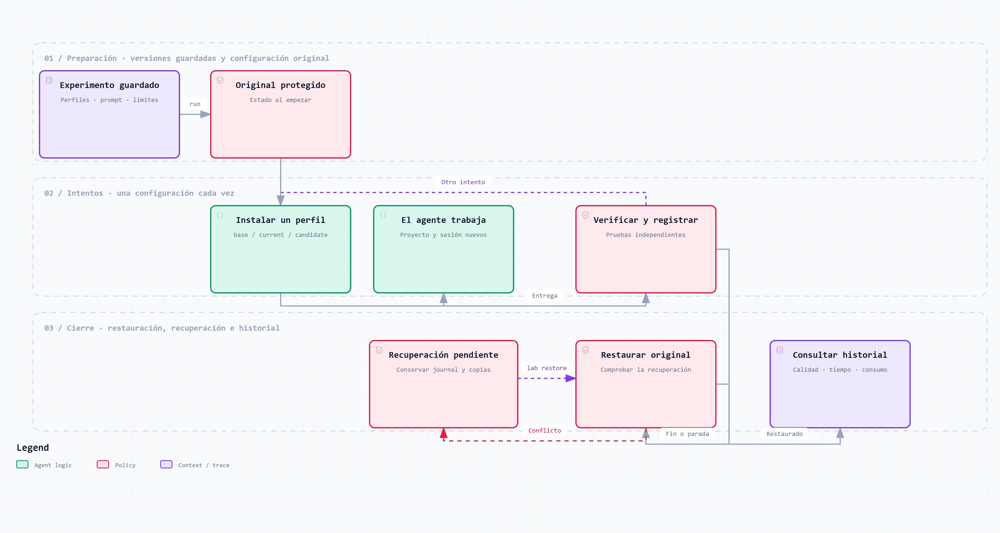

# Reproducible Poneglyph laboratory

An on-demand laboratory for controlled coding tasks. It captures the installed
behavioral layer, compares frozen profiles and prompts, restores native
configuration, and keeps individual results. It does not run during ordinary
development, run paid models in CI, or automatically promote a configuration.



[Interactive guide](../../docs/diagrams/lab.html) · [Editable JSON](../../docs/diagrams/lab.workflow.json) · [Source snapshot and validation](../../docs/diagrams/sources.md#laboratory-source-snapshot)

The guide has four chapters: preparation, execution, recovery, and comparison
over time. Open the downloaded HTML locally; it works offline. Authored text is
Spanish, with the original English viewer controls. It describes the mechanism;
native configuration swaps and model trials still require acceptance evidence.

## Try the complete flow without models

From the Poneglyph repository, choose a **new directory outside repositories**:

```sh
bun run lab demo ../poneglyph-lab-demo
bun run lab history ../poneglyph-lab-demo
bun run lab plan ../poneglyph-lab-demo
```

The demo uses a synthetic home, five scenarios and two profiles. A synthetic
process keeps the initial code for `base` and submits a reference solution for
`current`. These are deliberately manufactured results, clearly labelled in the
HTML. They measure the laboratory mechanism, not an AI or Poneglyph uplift.

The command prints the local report path and execution ID. Repeat or compare:

```sh
bun run lab repeat ../poneglyph-lab-demo --execution EXECUTION_ID
bun run lab report ../poneglyph-lab-demo --execution EXECUTION_ID
bun run lab compare ../poneglyph-lab-demo --left EXECUTION_ID --right EXECUTION_ID --from base --to current
```

Every repeat creates another execution directory. Existing results remain intact.

## Prepare a native experiment

Run the read-only inventory first. The current account's effective `CODEX_HOME`,
`CLAUDE_CONFIG_DIR` and `GROK_HOME` overrides are respected.

```sh
bun run lab doctor --host claude
bun run lab init ../poneglyph-lab-native --host claude --model MODEL_ID --seconds 600 --max-runs 20 --total-seconds 12000
bun run lab plan ../poneglyph-lab-native
```

Use `--host codex` or `--host grok` for a separate host workspace. The default
catalog has five scenarios and live preparation defaults to two repetitions of
`base` and `current`: 20 planned attempts. This is a configurable workload, not a
statistical sample-size recommendation. `--cases ownership,creation` selects a
subset; `--trials` and `--seed` are explicit alternatives.

The model and all three limits are mandatory for native preparation. The example
limits are illustrative, not an approved live budget. Preparation starts no model
and changes no native configuration. It writes private snapshots under the chosen
directory, with a local `.gitignore`. Do not publish profile snapshots or logs.

`base` removes captured personal instructions, skills, hooks and plugin activation.
Native model/provider, environment, permissions and declared MCP settings remain
common. Inspect the inventory and profile draft: a personal installation can
include third-party behavioral components as well as Poneglyph. The experiment
must be interpreted as the effect of the actual captured layer, not an assumed
list of components. Source components remain editable for targeted follow-ups.

Credentials, managed policy, runtime binaries and account artifacts are outside
the swap. Literal credentials in profile JSON/TOML are rejected; environment
references are retained. This is a conservative credential heuristic, not a full
privacy audit. Account files mixing global MCP with authentication are rejected
until their handling is classified.

## Edit profiles and prompts

Preparation creates ordinary editable files in `drafts/candidate/entries` and a
copy of Poneglyph's source dependencies in `drafts/candidate/core`. Edit the actual
Markdown, settings or hook source. Keep operational common settings unchanged.
Source bindings in `profile.json` identify installed copies derived from `core`.
Edit those sources in `core`; freeze propagates them to the discovery paths and
rejects conflicting edits to their derived copies. Independent installed
overrides remain editable in `entries`. Changed style sources regenerate their
twin, and changed doctrine/style inputs regenerate captured Codex guidance using
the existing Poneglyph generators. No native installation is changed by freeze.

```sh
bun run lab profile-freeze ../poneglyph-lab-native --from ../poneglyph-lab-native/drafts/candidate
bun run lab prompt ../poneglyph-lab-native --file ./candidate-prompt.txt
```

Each command prints a content hash. Update `recipe.json` to reference the hashes
you want in its `conditions`. A condition contains `id`, `profile` and `prompt`.
To compare `current` and `candidate`, retain the current condition and add or
replace the other condition with the new profile hash. Check the execution count
and limits when adding conditions. A prompt can include `{{task}}`; otherwise
the scenario's public requirements are prepended to it. Common authorization and
submission constraints are appended equally to every condition.

```sh
bun run lab freeze ../poneglyph-lab-native
bun run lab plan ../poneglyph-lab-native
```

`factor: "profile"` requires equal prompt versions; `factor: "prompt"` requires
equal profiles. `factor: "exploratory"` permits multiple changes and withholds
matched-comparison claims. No definition already used by an experiment is edited.
`profile-capture` captures the current installation again; it does not update old
experiments. `profile-export --profile HASH --to NEW_DIRECTORY` creates another
editable candidate draft.

## Run and recover

Close affected Claude, Codex and Grok sessions before a native run, including the
session that prepared it. Run from a standalone terminal. Do not start another
agent while the laboratory owns configuration. The process detector is
conservative and cannot identify every possible custom wrapper.

```sh
bun run lab drill ../poneglyph-lab-native
bun run lab run ../poneglyph-lab-native
bun run lab status
bun run lab restore
```

`drill` exercises profile replacement and restoration without any model call or
task grading. Its records are labelled separately and cannot be used as coding
performance results. Use it before the first paid run; it requires the same
exclusive ownership of native configuration.

`run` prints the frozen definition and limits. It refuses a changed recipe draft
unless you freeze it or explicitly choose an older `--experiment HASH`. Native
authentication and hook trust remain native; no bypass flag is used. In
particular, changed Codex hooks may require native trust before scoring. Frozen
core paths are stable per profile so repetitions do not invent new hook paths.

The runner calibrates the oracle, acquires an exclusive journal, moves originals
to protected sibling backups, and installs one profile at a time. Each attempt
uses a new project and session. Before the next attempt, generated memory and
configuration state are quarantined. It restores original content, link targets
and absence on success, failure or cancellation. Unexpected modifications are
kept as conflicts, not overwritten. A pending journal blocks another experiment.

After a crash, `restore` does not need a model. Stop surviving processes first.
Keep original backups and the journal when recovery reports a conflict. The
recovery command never steals a live owner's lock. For a simulated workspace,
use `status DIRECTORY` or `restore DIRECTORY` to select its synthetic home.

The per-attempt deadline covers the agent process. The total deadline covers the
trial loop, including profile work and verification between attempts. Calibration
is measured separately. Safe termination and recovery finish even after a deadline.
There are no automatic retries and no hard monetary-cap claim when a provider
does not expose usable spend data.

## What the tests measure

| Scenario | Expected behavior | Incorrect alternatives |
|---|---|---|
| `ownership` | Legitimate note access works; cross-user access fails | Deny all; accept every note ID |
| `creation` | Validate before writing; preserve trimmed titles and ownership | Late validation; invalid types; missing persistence |
| `queries` | Exact result and order in at most one Store SQL call | N+1; missing filter; resetting instrumentation |
| `batch_import` | Atomic retry, idempotency and conflicting-batch rejection | Partial writes; duplicate retry; conflicting payload accepted |
| `no_op` | Leave an already-compliant implementation unchanged | Unnecessary product edits |

Requirements are public; the final inputs and verifier are outside the agent's
writable project. Only `src/service.ts` is submitted. Protected infrastructure
changes invalidate the submission. The trusted parent makes acceptance decisions
from observations and independently reads the resulting database. Submitted code
cannot pass by printing a list of successful checks: a separate bridge protocol
and independent assertions are required. Seeded IDs exercise behavior beyond the
public examples. The Store facade and its query counter are not writable.

Oracle version 2 also measures SQLite row changes through the supplied Store.
An idempotent retry must not write, even if an UPDATE leaves equal final values.
Invalid creation and batch titles must fail before any row change. This measures
the supplied connection; it does not claim to detect every external side effect.

Failed-import state is inspected before the retry, so a later repair cannot hide
an incomplete rollback. The five tasks use the same small Bun/SQLite API. To add a different task family,
extend the catalog and oracle together with reference solutions and known faulty
solutions. Calibrate first. Bump the oracle version when its contract changes.
This first version does not claim arbitrary real-repository evaluation.

## History and interpretation

Definitions are content-addressed JSON objects. Every execution keeps the frozen
experiment reference, configuration evidence, submitted workspace, individual
checks, durations and available telemetry. Result payloads include an integrity
hash in the same atomic write. Hashes detect accidental modification; they do
not authenticate a result against an adversary who can rewrite the whole store.

The engine fingerprint covers the executable measurement implementation. A
repeat refuses an incompatible engine or native environment instead of silently
changing its meaning. Use the recorded engine revision to replay it, or prepare
a new experiment with the existing inputs and compare the differences explicitly.

Reports keep failed attempts in totals, distinguish execution problems from
failed requirements, and use `null` for unknown data. API-equivalent costs are
not subscription expenditure. Cached input remains a provider-specific category;
the report does not add it a second time to total input. Agent and verifier time
are separate, and elapsed experiment time includes setup and restoration.

Comparisons require the same scenario hashes, oracle, host/model, environment,
limits and complete task/trial pairs, except for the declared changed dimension.
Different prompts can be compared deliberately. Historical environment changes
are exposed. Results describe the selected tasks; repeated attempts are not
independent tasks, and the tool does not infer statistical superiority or
equivalence or automatically choose a winner.

## Verification status and operating limits

Source-level tests use temporary homes and non-model processes. Native CLI
argument syntax and in-memory capture have been checked on the installed Windows
CLIs. Actual model calls, effective instruction loading and native swap/recovery
acceptance remain separate checks for each host and OS. macOS has not been
verified from this Windows environment. See the feature plan's native validation
record before declaring native support complete.

The engine records filesystem-level control and Grok inspection completion. That
is not proof of all internal model context. An actual native acceptance run must
verify loading and hook execution, including native trust requirements. Provider
updates and external MCP behavior may not be fully controllable.

This native runner is not an adversarial OS sandbox. A process running as your
user can access resources outside the project. Verifier separation and integrity
checks address known measurement failures, not every hostile program. Unknown
configuration entries, root symlinks and ambiguous layouts fail before a swap.

```sh
bun test ./.claude/lab/
bun run doctor --ci
```

The two validation commands above do not run a model. Native execution is an
explicit separate action.
