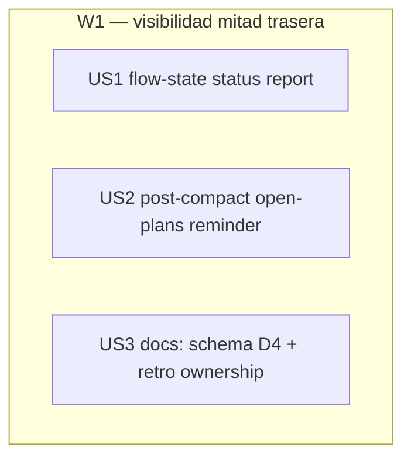

# Tasks index — Visibilidad de la mitad trasera del flujo /flow

## Resumen ejecutivo

Level: **Standard** — 3 HUs, single domain (config TS + docs), sin libs externas. TDD-mode: **optional** (test-policy=auxiliary); US1 opta a `tdd: forced` por lógica no trivial.

Tres HUs independientes (Wave única, Parallel Efficiency 100%) que cierran el gap de visibilidad de la mitad trasera: **US1** añade el subcomando `status` a `flow-state.ts` (funciones puras + CLI + tests); **US2** añade un recordatorio pasivo de planes abiertos a `post-compact.ts`; **US3** completa la documentación del schema (finding D4) + ownership de retro. Todo inline (3 HUs < 4 → sin Workflow).

**Decisión clave absorbida (gap-analysis)**: `post-compact.ts` es un hook *synced* (symlink a `~/.claude/`) pero `flow-state.ts` vive en `scripts/` que **no se sincroniza**. Para evitar un import roto-en-`~/.claude/`, US2 reimplementa un scan mínimo inline en el hook en vez de importar de flow-state.ts (Commandment III: 3 líneas similares > abstracción prematura/acoplada). Por eso US1 y US2 son independientes, no US2→US1.

## Estimación de esfuerzo

| Wave | HUs | Esfuerzo | Naturaleza |
|---|---|---|---|
| W1 (única) | US1, US2, US3 | ~1 sesión | TS puro + tests (US1, US2) + docs (US3) |

**Critical path**: ~1 sesión (las 3 son paralelas; inline secuencial corto).

## DAG

Sin aristas: las 3 HUs son 🔵 independientes (ficheros disjuntos, sin estado compartido). Parallel Efficiency = 3/3 = **100%**.

## Tabla resumen

| # | HU | Fase del workflow | Wave | Estimate | TDD-mode | Decisión absorbida |
|---|---|---|---|---|---|---|
| US1 | `status` report en flow-state.ts | Fase 3 | W1 | M | **forced** | funciones puras testeables |
| US2 | recordatorio planes abiertos en post-compact.ts | Fase 3 | W1 | S | optional | scan inline (no import → evita sync trap) |
| US3 | docs: schema state.json (D4) + retro ownership | Fase 3 | W1 | S | optional (validation-mode) | cierra finding D4 de la auditoría |

## Cross-cutting decisions

| Decisión | Dónde se toma | HUs afectadas | Criterio |
|---|---|---|---|
| Hook reimplementa scan inline (no importa flow-state.ts) | US2 | US1, US2 | flow-state.ts no se sincroniza a ~/.claude/; import rompería el hook synced. Duplicar ~8 líneas > acoplar (Cmd III) |
| Schema canónico = single source en flow.md | US3 | US1, US3 | US1 mantiene los campos (us_history, current_phase); US3 los documenta para que no vuelvan a divergir |

## Open questions (deferidas a Fase 3)

1. Formato exacto de salida de `status` (tabla vs líneas) — se decide en build mirando legibilidad; AC1 solo exige los campos.

## Anti-patterns mitigation

| Anti-pattern | Cómo se evita |
|---|---|
| Abstracción prematura (extraer scan a módulo compartido) | Duplicación deliberada documentada; revisitar solo si aparece un 3er consumidor |
| Recordatorio intrusivo (enforcement encubierto) | post-compact solo informa, nunca bloquea; sin cambios de control de flujo |

## Próximo paso

tasks/ en draft. Tras Fase 2.5 (tdd-design → tests.md/validations.md) y hard gate 2→3, abrir Fase 3 (build) en orden de wave (las 3 inline).
