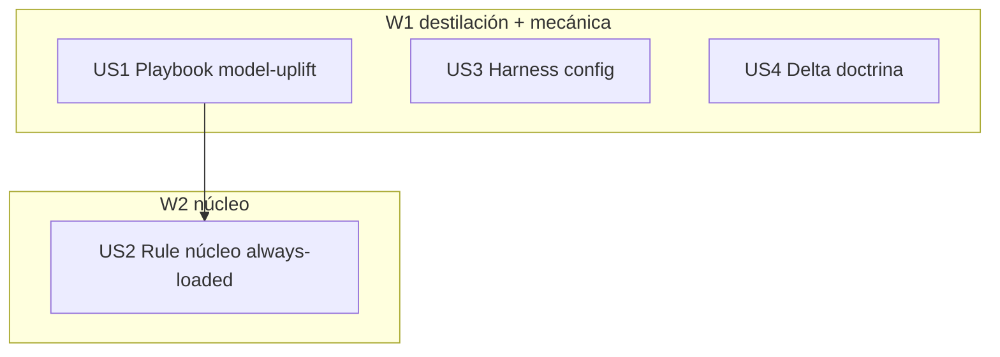

# Tasks index — Set de instrucciones post-Fable (Opus 4.8 / Sonnet 5)

Level: Standard — dominio único (capa meta poneglyph), sin APIs externas; el `full` del flow gobierna gates y stress de decisión, no ceremonia de planning.
TDD-mode: optional — policy `auxiliary` (test-policy.md); artefactos markdown + settings → validation-mode en Fase 2.5.

## Resumen ejecutivo

4 HUs en 2 waves. La sustancia vive en **US1** (el playbook: destilación introspectiva de Fable con evidencia por patrón — el insumo que caduca mañana); **US2** condensa el núcleo ≤25 líneas always-loaded que apunta al playbook; **US3** ajusta las palancas mecánicas del harness (fallbackModel, guía effort/model); **US4** barre la doctrina de referencias stale a modelos (única confirmada: `CLAUDE.md:117` "Explore (Haiku built-in)", obsoleta desde CC 2.1.198).

Decisión absorbida: el núcleo vive en `.claude/rules/model-uplift.md` (rule nueva, sync per-entry) y NO como sección de CLAUDE.md — lifecycle independiente (se poda limpia cuando cambie la era de modelos) y CLAUDE.md ya está denso. Alternativa CLAUDE.md-section rechazada en stress inline (Maintainer + coste de reversión).

## Estimación de esfuerzo

| Wave | HUs | Esfuerzo | Naturaleza |
|---|---|---|---|
| W1 destilación + mecánica | US1, US3, US4 | 1 sesión (hoy) | Escritura destilada + settings + sweep de refs |
| W2 núcleo + verificación | US2 | misma sesión | Condensación + sync + evals |

**Critical path**: US1 → US2 (~1 sesión total; deadline: hoy).

## DAG

Parallel Efficiency Score: 3/4 = **75%** (≥50% ✓). US1/US3/US4 🔵 (ficheros disjuntos), US2 🟡 (cita anclas del playbook).

## Tabla resumen

| # | HU | Fase | Wave | Estimate | TDD-mode | Decisión absorbida |
|---|---|---|---|---|---|---|
| US1 | Playbook `docs/model-uplift-playbook.md` (destilación Fable + anti-fallos + guía dual) | 3 | W1 | M | optional | — |
| US2 | Rule núcleo `rules/model-uplift.md` ≤25 líneas + sync + evals | 3 | W2 | S | optional | híbrido core→playbook |
| US3 | Harness: `settings.json` fallbackModel + guía effort/model | 3 | W1 | S | optional | — |
| US4 | Delta doctrina: refs stale a modelos (CLAUDE.md:117 + sweep skills/commands) | 3 | W1 | S | optional | — |

## Research

- Interno: auditorías 2026-06-30 y 2026-07-02 (corpus de comportamiento Fable observado), memoria persistente (anti-fallos documentados de modelos previos), transcripts de esta sesión.
- Changelog CC 2.1.154→2.1.201 (aportado por el usuario en sesión — Explore hereda modelo desde 2.1.198; Sonnet 5 default 1M desde 2.1.197; effort xhigh; fast mode Opus 4.8).
- Context7: no aplica (sin APIs externas). Discovery anti-duplicado ejecutado: no existe rule/doc model-uplift previo; solape con output-style/CLAUDE.md controlado por el filtro "solo deltas" (spec AC3).

## Drillme — Phase 2 (cerrado)

1. Simpler? — considerado single-file always-loaded: viola el cap de 25 líneas o pierde profundidad; híbrido gana. 2. Wheel? — no hay componente previo (Glob/Grep ✓); el solape con doctrina existente se controla con el filtro solo-deltas. 3. Atomic? — 4 HUs, ≤4 ficheros cada una. 4. Real deps? — solo US1→US2 (anclas citadas). 5. Failure tolerance? — cada HU tiene valor independiente; si US2 falla, el playbook ya existe. 6. Location? — rules/ y docs/ son las capas sync correctas (per-entry y whole-dir verificadas).

## Open questions (deferidas a Fase 3)

1. IDs exactos de modelo para el cascade de `fallbackModel` — verificar contra el entorno en build (Cmd II), no asumir.

## Próximo paso

Fase 2.5 (tdd-design → validations.md) y hard gate 2→3.
