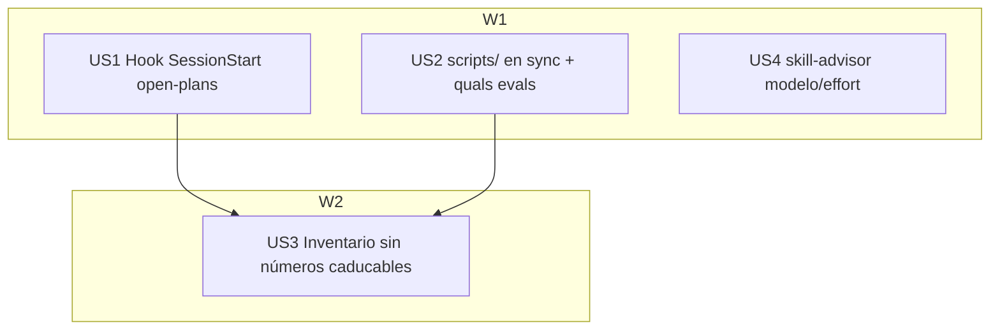

# Tasks index — ROI fixes + model/effort advisor

Level: Standard — 4 frentes en ficheros conocidos, sin APIs externas; hook nuevo con registro+tests.
TDD-mode: optional (policy `auxiliary`) con opt-in `tdd: forced` en US1 (lógica de hook; precedente 025).

## Resumen ejecutivo

4 HUs, 3 paralelas + 1 dependiente. US1 lleva el único código nuevo (hook SessionStart que reutiliza `openPlansReminder()` ya exportado por `post-compact.ts` — verificado en discovery, cero duplicación y cero sync-trap). US2 mata la clase RI-1 añadiendo `scripts` a LINK_FOLDERS y califica las 3 instrucciones de evals halladas por grep (meta-settings-cookbook:48, meta-create:92, doctrine-sweep:24). US4 extiende skill-advisor con la propuesta modelo/effort (fuente única: playbook §4; gated "solo si difiere"). US3 va última: convierte los números caducables del inventario en punteros Y absorbe los conteos que US1/US2 cambian (hooks 7→8, scripts pasa a sincado) — dependencia real de fichero, no cosmética.

## Estimación de esfuerzo

| Wave | HUs | Esfuerzo | Naturaleza |
|---|---|---|---|
| W1 | US1, US2, US4 | ~1 sesión | hook+tests / sync+quals / extensión skill |
| W2 | US3 | misma sesión | pasada doc que absorbe W1 |

**Critical path**: W1(US1) → W2(US3).

## DAG

Parallel Efficiency Score: 3/4 = **75%** (≥50% ✓). 3 HUs de escritura en W1 → **inline secuencial** (fan-out de escritura solo con opt-in; no lo hay).

## Tabla resumen

| # | HU | Wave | Estimate | TDD-mode | Decisión absorbida |
|---|---|---|---|---|---|
| US1 | Hook SessionStart open-plans (import de post-compact) + registro + tests | W1 | S-M | **forced** | reuso de export existente, no lib nueva |
| US2 | `scripts` en LINK_FOLDERS + calificar 3 instrucciones evals | W1 | S | optional | — |
| US4 | skill-advisor: propuesta modelo/effort desde playbook §4, gated | W1 | S | optional | extender, no skill nueva (Cmd X) |
| US3 | system-inventory: números → punteros (absorbe conteos de US1/US2) | W2 | S | optional | — |

## Research

Interno (discovery ejecutado): `post-compact.ts:10` exporta `openPlansReminder(plansRoot)` pura; settings.json hooks = 6 eventos sin SessionStart; LINK_FOLDERS actual = [skills, commands, docs, hooks, workflows, output-styles]; sitios evals = 3 (grep); estructura skill-advisor (§Workflow a extender); caducables restantes en inventario: hooks "7 registered", rules "2 + paths/" (ya stale — falta model-uplift), roles "13". Externo: N/A. Eventos de hook: SessionStart soportado (rules/paths/hooks.md + CC ≥1.0.62; stdout de SessionStart inyecta contexto).

## Drillme — Phase 2 (cerrado)

1. Simpler? — sí evaluado: importar el export existente ganó a lib nueva y a duplicar inline. 2. Wheel? — no: el scan existe y se reutiliza; el selector extiende skill-advisor en vez de crear skill. 3. Atomic? — 4 HUs ≤5 ficheros. 4. Real deps? — US3←US1/US2 es dependencia de contenido real (conteos). 5. Failure tolerance? — cada HU vale sola; si US1 falla, US2/US4 cierran igual. 6. Location? — hooks/ para el hook (synced), SKILL.md para el selector, convención respetada.

## Open questions (deferidas a Fase 3)

1. Verificar que `post-compact.ts` tiene guard `import.meta.main` (para importarlo sin ejecutar su main) — si no, añadirlo en US1.

## Próximo paso

Fase 2.5 (tests.md para US1 + validations.md para US2-4) y gate 2→3.
