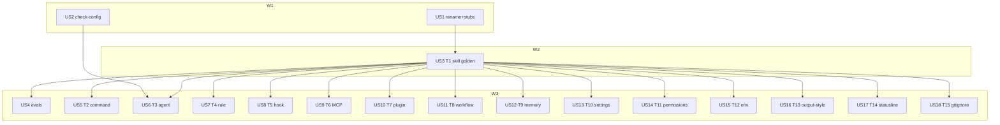

# Tasks index — meta-harness

Level: Full — 15 artifact types × 3 hosts × lifecycle, plus rename/gate/evals.
TDD-mode: optional (project `auxiliary`) — `tdd: forced` on US2 (check-config) and US4 (evals). Type packs are validation-mode.

## Resumen ejecutivo

Una skill `meta-harness` sustituye `meta-create` + `meta-settings-cookbook` como punto de entrada del ciclo de configuración nativa (consultar, crear, modificar, desactivar, borrar) en Claude Code, Codex y Grok Build.

18 HUs. Wave 1 pone el nombre y el gate. Wave 2 pone T1 como plantilla-de-plantillas. Wave 3 entrega evals de disparo y los 14 tipos restantes en paralelo de DAG (el Lead ejecuta en serie). T3 espera también al gate de agents (US2).

Cortes absorbidos: D20–D29. Pack done = contrato de 7 puntos del spec, no un tratado.

## Estimación de esfuerzo

| Wave | HUs | Esfuerzo | Naturaleza |
|---|---|---|---|
| W1 Rename + gate | US1, US2 | 1 sesión | rename/stubs/sweep + check-config |
| W2 T1 golden | US3 | 1 sesión | pack + templates skill |
| W3 Types + evals | US4–US18 | 5–8 sesiones | 1 eval HU + 14 packs delgados |

**Critical path**: US1 → US3 → (US4 ∥ types). ~7–10 sesiones inline. T3 (US6) también espera US2.

## DAG

## Tabla resumen

| # | HU | Wave | Estimate | TDD-mode | Decisión |
|---|---|---|---|---|---|
| US1 | Rename `meta-harness` + stubs + sweep + budget | W1 | M | optional | D21 D27 AC28–30 |
| US2 | check-config AC19 recipe + AC20 three-host agents | W1 | M | forced | D15 AC19–20 (baked: Claude/Grok md + Codex toml) |
| US3 | T1 skill golden pack + templates | W2 | L | optional | D24 D26 D29 AC26 |
| US4 | Evals create/modify/delete/consult | W3 | S | forced | D28 AC27 |
| US5 | T2 command | W3 | S | skip: pack docs | D23 |
| US6 | T3 agent/subagent | W3 | M | skip: pack docs | AC20 |
| US7 | T4 rule | W3 | S | skip: pack docs | D23 |
| US8 | T5 hook | W3 | M | skip: pack docs | AC25 |
| US9 | T6 MCP | W3 | S | skip: pack docs | D23 |
| US10 | T7 plugin | W3 | S | skip: pack docs | D23 |
| US11 | T8 workflow | W3 | M | skip: pack docs | D13 Codex ausente |
| US12 | T9 memoria (cookbook 01) | W3 | S | skip: pack docs | D27 |
| US13 | T10 settings (cookbook 02) | W3 | S | skip: pack docs | D27 |
| US14 | T11 permisos (cookbook 05) | W3 | S | skip: pack docs | D27 |
| US15 | T12 env (cookbook 04) | W3 | S | skip: pack docs | D27 |
| US16 | T13 output style (cookbook 03) | W3 | S | skip: pack docs | D13 Codex/Grok ausente |
| US17 | T14 statusline (cookbook 07) | W3 | S | skip: pack docs | D27 |
| US18 | T15 gitignore (cookbook 06) | W3 | S | skip: pack docs | D27 |

## Research

| Fuente | Hallazgo | HUs |
|---|---|---|
| https://agentskills.io/specification | `description` ≤1024; `name` ≤64; SKILL.md &lt;500 líneas | US3, US2 |
| https://learn.chatgpt.com/codex/build-skills.md | Codex skills; disable `[[skills.config]]`; listing 2%/8000 | US3, US11 |
| openai/codex `parser.rs` + PR #29006 | load no rechaza description larga; listing trunca 1024 | US2, US3, D29 |
| `~/.grok/docs/user-guide/` | skills, hooks, subagents, status-line, workflows `.rhai` | US3, US6, US8, US11, US17 |
| `.claude/scripts/check-config.ts` | gate actual; no escanea agents ni templates/ | US2 |
| `.claude/evals/cases.jsonl` | 0 casos meta-create/cookbook | US4 |
| `skill-advisor/lib/rank.ts` | `USAGE_TIER["meta-create"]` | US1 |

## Cross-cutting decisions

| Decisión | Dónde | HUs | Criterio |
|---|---|---|---|
| Pack = 7 puntos | spec + US3 | US3, US5–US18 | AC9 thin pack |
| Lookup = receta, no script | D22 | todas type | URL/path + fecha + CLI |
| Cookbook por tipo | D27 | US1 stub; US12–US18 mueven | AC14 |
| Native creators en T1/T8 | D25 | US3, US11 | AC26 |
| 1024 no 500 | D29 | US2, US3 | no fila AC19 nueva |

## Open questions (deferidas a Fase 3)

1. Layout fino de `templates/` bajo `meta-harness/` si T1 descubre un subtipo extra (reference/research/workflow ya existen).
2. SkillsBench v4: reanclar cifras E1 al escribir `references/evidence.md` (US3).
3. Fecha de prune de stubs: fila al aterrizar US1; borrado cuando grep vivo = 0 (fin de ciclo, no esta HU).

## Anti-patterns mitigation

| Anti-pattern | Cómo se evita |
|---|---|
| 15 tratados vendor | contrato 7 puntos; celda ausente explícita |
| Packs con nombre viejo | US1 primero (D21) |
| Cookbook absorbido dos veces | US1 stub only; slice en US12–US18 |
| Evals esperan a T15 | US4 cuelga de US1+US3 (D28) |
| CI rojo en catálogo | AC19: no error nuevo sin barrido; D29 no añade regla |

## Drillme — Phase 2

| # | Pregunta | Respuesta |
|---|---|---|
| 1 | ¿Más simple? | Familias. Oriol eligió un HU por tipo (D23). |
| 2 | ¿Reinventa? | Reusa `check-config`, doctrine-sweep, evals jsonl, templates existentes. |
| 3 | ¿Atómico? | Type HUs = 1 pack. US3 es L (golden); smell aceptado. |
| 4 | ¿Deps reales? | T1 golden; T3 espera AC20; evals esperan description+T1. |
| 5 | ¿Si una type-HU falla? | Las otras de W3 siguen (salvo T3 si US2 falla). US1 falla → todo para. |
| 6 | ¿Sitio? | `.claude/skills/meta-harness/` — convención del spec. |

Coverage: 4/4 canonical + 6/6 phase-2.

## Próximo paso

Oracle escrito: `tests.md` (US2, US4) + `validations.md` (US1, US3, US5–US18).
Gate 2→3 pendiente: confirmar A1–A4 (scan de agents) y APPROVE | REFINE | BLOCK.
No `complete-phase 2` / 2.5 hasta ese gate. No implementar `meta-harness` aún.
