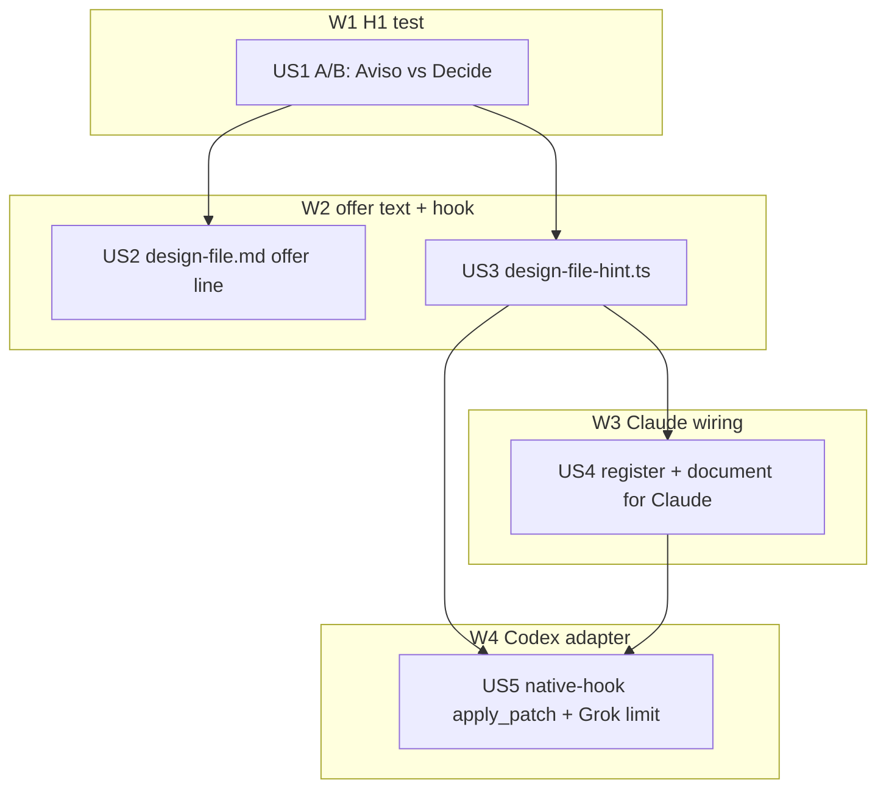

# Tasks index — design-file note on the first UI edit

Level: Standard — two hosts' hook contracts carry ambiguity (verified in the docs below); one new hook, no auth or data.
TDD-mode: adaptive — `rules/test-policy.md` project level is `auxiliary`; inside `/flow-lifecycle` behavior-changing HUs get `tdd: forced` (US3, US5); the A/B spike (US1), the reference text (US2) and the registration plus docs (US4) use validations.

## Resumen ejecutivo

Five HUs in four waves. US1 settles hypothesis H1 first: two headless runs with `ui-design` loaded explicitly, offer in `Aviso:` vs a bold `**Decide:**` line. Its result fixes the wording for US2 (the skill reference) and for the note the hook injects (US3).

US3 builds one new PreToolUse hook, `design-file-hint.ts`, with pure functions: UI-file test, design-file lookup, note text, once-per-session check. The log line it writes in `<cwd>/.claude/learned/design-file-hints.log` is both the observability record and the session marker, so there is no second state store. US4 registers it for Claude Code and documents it. US5 reuses the same functions from `native-hook.ts` for Codex `apply_patch` and documents Grok's limit.

The live acceptance probes (spec AC3, AC4: V7.6 "with" and "without" plus 3 held-out prompts) run in review, on the installed hook. Budget: 2 A/B runs plus 5 review runs = 7 of the 8 approved `claude -p` runs on `claude-sonnet-5-5`.

## Estimación de esfuerzo

| Wave | HUs | Esfuerzo | Naturaleza |
|---|---|---|---|
| W1 H1 test | US1 | 25 min | 2 headless runs, read reports |
| W2 offer text + hook | US2, US3 | 15 + 40 min | Doc edit; new hook red→green |
| W3 Claude wiring | US4 | 25 min | Settings, sync, docs |
| W4 Codex adapter | US5 | 30 min | Adapter branch red→green, config, docs |

**Critical path**: US1 → US3 → US4 → US5, about 120 min. With US2 and review (40 min, 5 probe runs): **175 min total**. Start: 2026-10-02 11:21 CEST (`date`).

## DAG

US5 depends on US4 only because both edit `docs/harness-adapters.md` and `rules/paths/hooks.md`; editing them in one order avoids conflicting rows.

## Tabla resumen

| # | HU | Wave | Estimate | TDD-mode | Spec AC | Prompt score |
|---|---|---|---|---|---|---|
| US1 | A/B the offer line with ui-design loaded | W1 | S | skip | AC3 (input) | 90 |
| US2 | Move the offer to the winning line form | W2 | S | optional | AC3 | 95 |
| US3 | New hook: note once per session on a UI edit | W2 | M | forced | AC1, AC2 | 95 |
| US4 | Register for Claude, sync, document | W3 | S | optional | AC1, AC6 | 95 |
| US5 | Codex `apply_patch` adapter, Grok limit | W4 | M | forced | AC5 | 95 |

Prompt scores use `prompt-design/scoring-criteria.md` (Clarity, Context, Structure, Success, Actionable; 20 each). Points lost: US1 −10 (Success and Actionable: the winner rule lived only in this index, now copied into the prompt); US2–US5 −5 each on Actionable, because each depends on the US1 wording. All ≥80, so build proceeds directly.

## Cross-cutting decisions

| Decisión | Dónde se toma | HUs afectadas | Criterio |
|---|---|---|---|
| Offer form (`Aviso:` or `**Decide:**`) | US1 | US2, US3 | More offers in 2 runs wins; tie → `**Decide:**`, because the style already says what needs the user goes on its own line or in bold |
| Note wording is factual | US3 | US5 | Claude Code docs: imperative hook text can trip prompt-injection defenses |
| Lookup root = payload `cwd` | US3 | US5 | Same base as the other hooks' `.claude/learned/` logs; `ponytail:` comment for monorepo subdirectories |
| Session marker = the log line | US3 | US5 | One store; observable by `grep <session_id>` |

## Skills (choose-skills, ratified)

| Skill | Phase | Why |
|---|---|---|
| `harness-config` (T5 hook, T10 settings) | 2, 3 (US3–US5) | New hook and a settings registration; its pass added the measured hook counts, D12 and the Windows note to US4/US5 |
| `prompt-design` | 2 | Scores each Execution prompt (≥70) |
| `drillme-clarify` | 1, 2, 2.5 closes | Phase banks |
| `flow` (`test-plan`, `build`, `review`, `retro`) | each phase | Invoked explicitly per phase |
| `changes-verify` | 3, 4 | `skill-routing.md` row before reporting runtime work done |

Ratified without a question: the approved plan names each one. Discarded: `consult-model` (no outside opinion needed), `orca-team` and `orca-swarm` (no team approved), `diagrams-interactive` (the DAG is a Mermaid block), `dev-workflow` (already loaded). Model/effort: the session default fits the build; review runs at `/effort xhigh` (`model-uplift-playbook.md` §4).

## Research

- Claude Code hooks: PreToolUse `hookSpecificOutput.additionalContext` lands next to the tool result; input carries `session_id`, `cwd`, `tool_name`, `tool_input`; factual wording advised. https://code.claude.com/docs/en/hooks (fetched 2026-10-02).
- Codex hooks: PreToolUse covers `apply_patch` (matcher `apply_patch`, `Edit` or `Write`; `tool_name` is always `apply_patch`; `tool_input.command` is the patch text); `additionalContext` supported; `session_id`, `cwd` present. https://learn.chatgpt.com/docs/hooks (fetched 2026-10-02).
- Project patterns reused: `hooks/headless-model-gate.ts` (pure judge + `import.meta.main` wrapper, best-effort catch), `hooks/instructions-loaded.ts` `appendLog`, `hooks/lib/hook-stdin.ts`, `hooks/native-hook.ts` PreToolUse dispatch, `scripts/lib/native-hooks.ts` `nativeHookConfig`.

## Drillme — phase 2

1. `[approach]` Simpler option: a UserPromptSubmit check cannot know the task touches UI; text-only skill changes failed four times in 039. A PreToolUse note with a log-line marker is the smallest deterministic point.
2. `[context]` Reuse: stdin reader, `appendLog`, native dispatch and config builder are reused; nothing is duplicated.
3. `[approach]` Atomic: each HU fits one session. US1–US4 touch ≤5 files; US5 touches 6 (2 code, 2 tests, 2 doc rows), kept whole because the doc rows describe the code it adds.
4. `[context]` Dependencies are functional (US1 sets wording; US3 provides the functions) except US4→US5, which is file-order only and stated above.
5. `[failure]` US1 inconclusive (0 offers in both arms) → the tie rule picks `**Decide:**` and the hook carries the fact; review measures the result. US5 failing leaves Claude working.
6. `[location]` Hook in `.claude/hooks/`, tests in `.claude/hooks/__tests__/`, the convention for every hook.
- Lateral, performance: the hook runs on every Edit/Write; a non-UI path returns before any filesystem call. Lateral, security: the hook only stats three fixed names under `cwd` and appends one log line; no payload text reaches a shell.

Zero open gaps.

## Drillme — phase 1 (scope check, run in B0 against the approved spec)

1. `[approach]` Root problem: stated in the spec (skill loading depends on keywords; the offer loses the single `Aviso:` slot).
2. `[failure]` If we skip it: no repo without a design file ever gets the offer, so the design-system work of 039 only reaches repos that already have the file.
3. `[context]` Who suffers: the user, in every UI repo without a design file.
4. `[approach]` MVP: the note plus the offer form; nothing else is in the HUs.
5. `[location]` Out of scope: listed in the spec.
- Lateral, data footprint: the hook writes `<cwd>/.claude/learned/design-file-hints.log` in any repo. `instructions-loaded.ts:53` already writes `<cwd>/.claude/learned/` in every repo, so the footprint is not new.
- Lateral, Grok double run: Grok could run Claude hooks through `[compat.claude]`; `~/.grok/config.toml` has `hooks = false`, so it does not.

No gap changes the scope; gate 1→2 stands and `spec.md` is unchanged.

## Drillme — phase 2.5 (oracle design)

1. `[failure]` Happy and edge per HU: US3 T3.1–T3.9 (edges: non-UI, non-edit tool, malformed payload, unwritable log, several paths); US5 T5.1–T5.4 (edges: non-UI patch, repeat session, Grok); US1, US2, US4 in `validations.md`.
2. `[approach]` Untestable HUs: none (0 %).
3. `[approach]` Property-based: N/A — `isUiFile` is a fixed list of seven extensions; examples cover it.
4. `[approach]` Mode honest: US3 and US5 are code (TDD); US1 (experiment), US2 (markdown) and US4 (JSON plus docs) are validations. US5's two doc rows get a grep check inside `tests.md`.
- Lateral, concurrency: two parallel first edits in one session can both run before either writes the log line, giving two notes. Residual risk, not fixed: it costs a duplicate note. X1 stays strict; a double line in review is reported as this race, not hidden.

Zero open gaps; 0 questions to the user, because every gap closed against files.

## Open questions (deferidas a Fase 3)

1. None.

## Próximo paso

Phases 2 and 2.5 complete, with the B0 corrections applied (skills, `harness-config`, prompt scores, `test-plan`, drillme for phases 1, 2 and 2.5 in one invocation). Gate 2→3 pending the user's decision.
