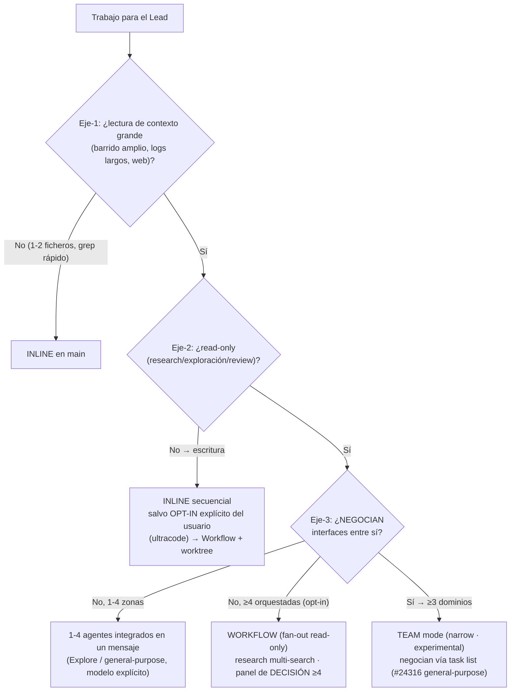

# Spawn decision tree — diagram

Resolve explicit consultations, native sessions, and supervised teams through the
[shared routing contract](../../../rules/skill-routing.md) first. The diagram below
describes default native delegation. It does not override those explicit routes.
Permission and model choice remain owned by CLAUDE.md §Agent spawn.

Relocated from `SKILL.md` §Step 1 on 2026-09-03 (plan 032/WP4 — the table of principles P1–P8 stays inline; the diagram duplicated it). Built-in agents need no approval (CLAUDE.md §Agent spawn, 2026-10-08).

Reading order: axis 1 asks whether the work means reading a large context (no → inline); axis 2 whether it is read-only (write fan-out needs explicit opt-in); axis 3 whether units negotiate interfaces (1–4 independent areas → built-in agents in one message, ≥4 orchestrated → Workflow, negotiating → Team mode).
