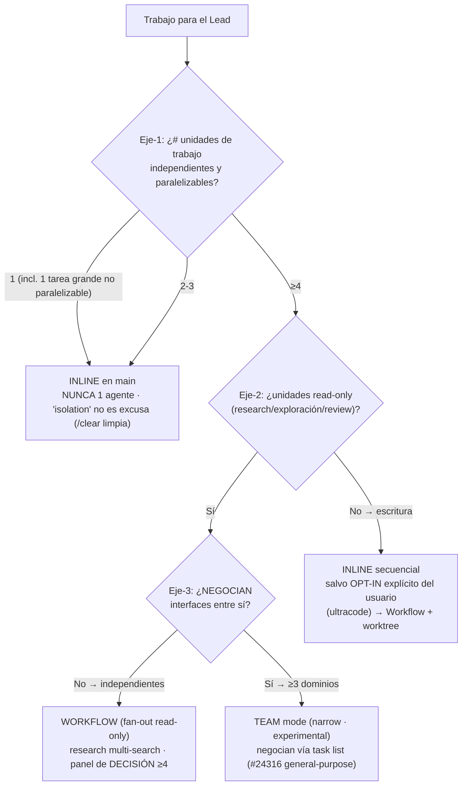

# Spawn decision tree — diagram

Relocated verbatim from `SKILL.md` §Step 1 on 2026-09-03 (plan 032/WP4 — the table of principles P1–P8 stays inline; the diagram duplicated it). Applies only **after** the user approved spawn and model (CLAUDE.md §Agent spawn).

Reading order: axis 1 counts independent, parallelizable units (1–3 → inline, always); axis 2 asks whether the ≥4 units are read-only (write fan-out needs explicit opt-in); axis 3 asks whether they negotiate interfaces (Workflow when independent, Team mode when they do).
