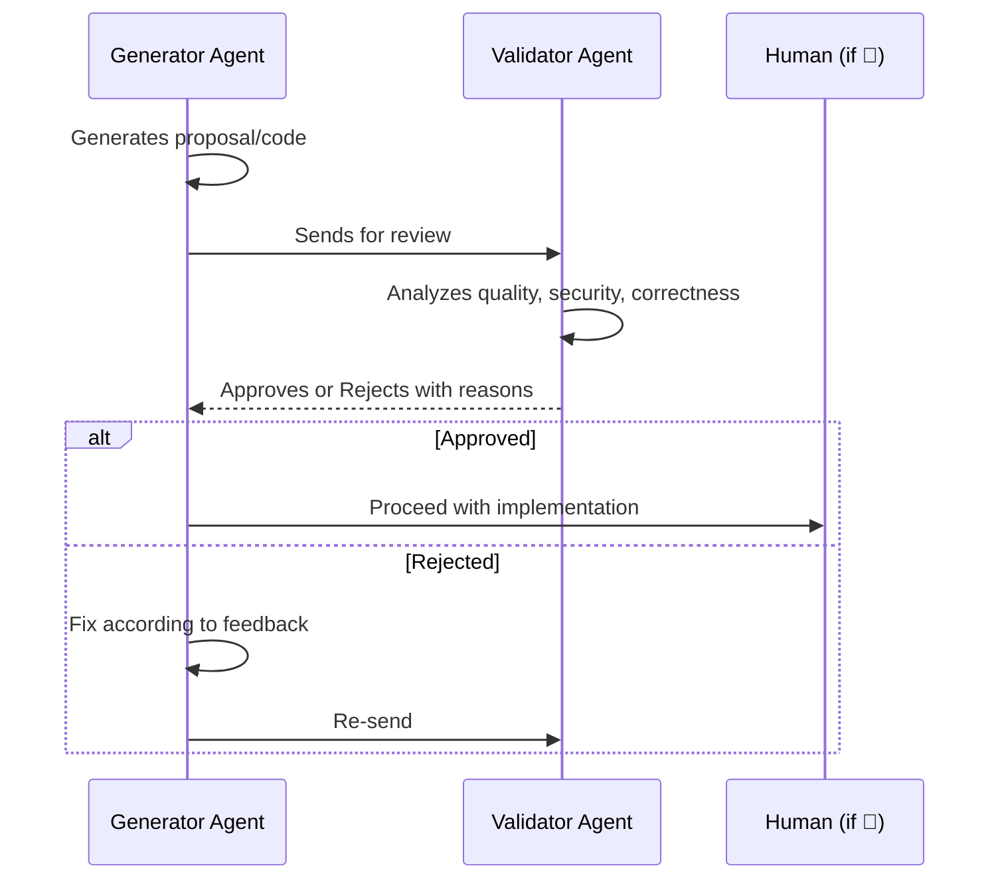

# Team Mode + Cross-Validation — references/07

## Contents

- [Cross-Validation (Four-Eyes Principle)](#cross-validation-four-eyes-principle)
- [Team Mode Planning](#team-mode-planning)

> **Post-feature-008 mapping** — the named agents in this doc (`planner`/`builder`/`reviewer`/`scout`) were **cut**. Team mode now uses generic **scoped teammates** (experimental, `CLAUDE_CODE_EXPERIMENTAL_AGENT_TEAMS=1`); map `builder` → `build` skill / impl unit, `reviewer` → Phase 4 `critic` / review panel (≥4), `scout` → `Explore` (built-in), `planner` → `tech-plan` skill. The patterns (Four-Eyes generator→validator, domain boundaries, recovery loop) **remain valid** — only the agent names died. The generator→validator pattern is exactly what a `Workflow` `pipeline(items, find, verify)` encodes.
>
> **Spawn model (CC 2.1.178)** — there is **no setup step**: `TeamCreate`/`TeamDelete` were removed; with the flag set, every session has one **implicit team**. Spawn a teammate directly via the `Agent` tool's `name` parameter (the old `team_name` param is accepted but ignored). Permission rules can scope spawns with `Tool(param:value)` syntax, e.g. `Agent(model:opus)`.

## Cross-Validation (Four-Eyes Principle)

**Principle**: For critical decisions, use the LLM-as-Judge pattern where one agent reviews another's work.

### When to Apply

| Type of Decision | Requires Cross-Validation |
|-----------------|--------------------------|
| New architecture | Yes |
| Refactoring >5 files | Yes |
| Public API change | Yes |
| Data migration | Yes |
| Simple bug fix | No |
| Config change | No |
| New isolated endpoint | No |

### Validation Workflow



### Agent Combinations

> Generator/Validator below are **roles**, not custom agents (those were cut — see L14). Map: generator = impl teammate / `build` skill; validator = review teammate / `critic`. The pattern = a `Workflow` `pipeline(items, find, verify)`.

| Task | Generator (role) | Validator (role) |
|------|-----------|-----------|
| New architecture | `tech-plan` (Mode B) | `critic` |
| Complex refactoring | `build` | `critic` |
| Feature with security | `build` | `critic` (+ `security-audit`) |
| Critical tests | `build` | `critic` |

---

## Team Mode Planning

When the Lead requests a plan with `execution_mode = team` (complexity > 60, 3+ independent domains), extend the standard plan with these additional sections.

### Team Assembly

Select agents based on task analysis:

| Role (skill) | Condition | Required |
|-------|-----------|----------|
| `Explore` (exploration) | Codebase exploration | ALWAYS |
| `build` (implementation) | Code implementation | ALWAYS |
| `critic` (validation) | Quality validation | ALWAYS |
| `tech-plan` (Mode B) | Complexity > 40 OR cross-domain interfaces — emits RFC + contracts inline | CONDITIONAL |
| `security-audit` | Keywords: auth, token, password, jwt, encryption | CONDITIONAL |

### Domain Boundary Definition

For each teammate, define explicit boundaries in the plan:

| Field | Content | Example |
|-------|---------|---------|
| **Domain** | Logical area of responsibility | "Authentication service" |
| **Owned paths** | Files this teammate may modify | `src/auth/**`, `tests/auth/**` |
| **Forbidden paths** | Files this teammate must NOT touch | Everything outside owned paths |
| **Exposes** | Interfaces/contracts other domains consume | `AuthResult`, `validateToken()` |
| **Consumes** | Interfaces/contracts from other domains | `UserProfile` from user-domain |

### Teammate Prompt Template

Each teammate receives a structured prompt in the plan:

```
Domain: [X]. You own files in [paths]. Do NOT modify files outside your domain.

Tasks:
1. [subtask from roadmap]
2. [subtask from roadmap]

Interfaces:
- EXPOSE: [type/function] consumed by [other domain]
- CONSUME: [type/function] from [other domain]

Coordination: Use task list to signal completion and coordinate with other teammates.
```

### Recovery Plan (Team)

| Scenario | Action | Max retries |
|----------|--------|-------------|
| Teammate test failure | Analyze error, fix, re-run | 2 |
| NEEDS_CHANGES from `critic` | Apply feedback, re-submit | 3 then escalate |
| Teammate stuck (no progress) | Fold domain back to inline `build` | 0 |
| File conflict between teammates | Lead arbitrates via `critic`, loser re-executes | 1 |
| Multiple teammates fail | Abort team mode → fallback to subagents/inline | 0 |
| Architecture mismatch | `tech-plan` (Mode B) redesigns contracts, re-delegate | 1 |

### Correction Loop

```
1. impl teammate (`build` role) implements
2. review teammate (`critic` role) evaluates
3. If NEEDS_CHANGES:
   a. impl teammate fixes according to feedback
   b. review teammate re-evaluates
   c. Max 3 iterations before escalating to Lead with full history
4. If APPROVED: mark task complete
```

### Team Plan Output Additions

When `execution_mode = team`, the standard output must additionally include:

| Section | Content |
|---------|---------|
| **Execution mode** | `team` in Objective section |
| **Domain boundaries** | Table per teammate with owned/forbidden paths |
| **Interface contracts** | Types and signatures shared between domains |
| **Env requirement** | `CLAUDE_CODE_EXPERIMENTAL_AGENT_TEAMS=1` |
| **Fallback strategy** | What happens if team mode prerequisites fail |
