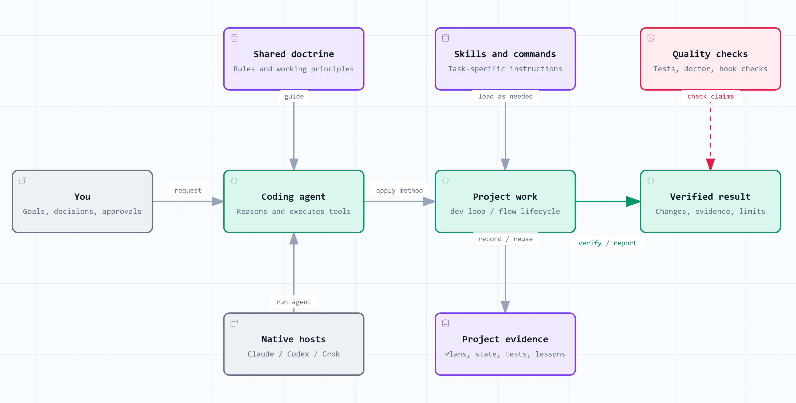
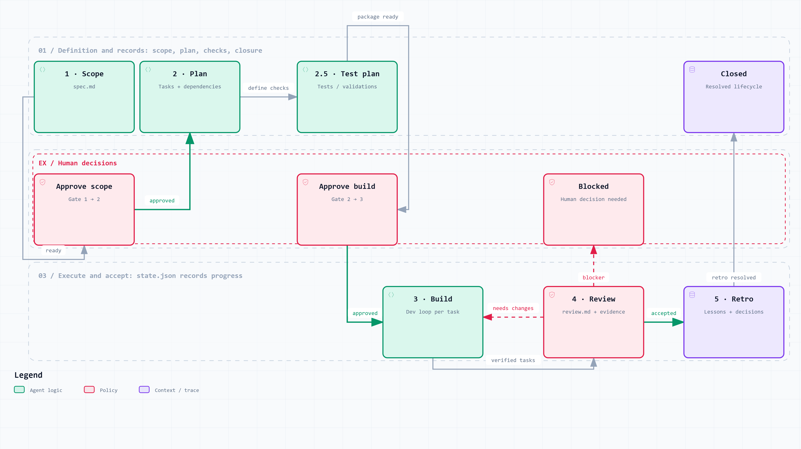
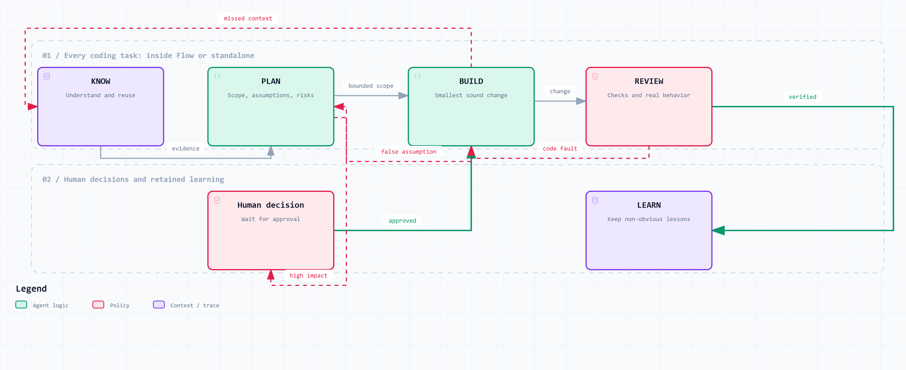

# Poneglyph

Personal orchestration layer for Claude Code, Codex and Grok Build. The three
adapters share doctrine, skills, command sources and quality checks. Native
entrypoints adapt each host's contracts; model behavior, permissions and
authentication remain host-specific. Grok reuses Claude discovery with inherited
Claude hooks disabled, then adds the native Poneglyph hook.

> **This file is the single source of truth for installation.**
> Deep per-tool detail lives in [`docs/`](./docs); the steps below are the
> canonical path to a working setup on **Windows 11 (PowerShell, no admin)**.

This repository starts a new Git history from the reviewed PR #3 snapshot. The
previous repository is a private historical reference; do not merge its Git
history into this repository. See [the migration boundary](.claude/docs/repository-migration.md).

---

## How Poneglyph works

Poneglyph gives coding agents a shared working method. You provide goals and
decisions; the agent uses instructions, tools, and evidence to carry out the work.
Commands coordinate a process. Skills provide task-specific instructions.

| Layer | When it applies | Benefit | Cost or limit |
|---|---|---|---|
| **Poneglyph** | Across projects and supported hosts | Reuse one maintained set of working principles and skills | Context and maintenance costs; host behavior still differs |
| **Flow** | A feature needing scope, dependent tasks, and acceptance | Trace decisions from requirements to verified closure; resume recorded progress | Preparation, approval waits, and state maintenance |
| **Dev** | Every coding task, inside Flow or standalone | Reuse before building; verify behavior and revisit failed assumptions | Research and review take effort; written stages do not execute themselves |

### Poneglyph at a glance



[Interactive HTML](docs/diagrams/poneglyph.html) · [Editable JSON](docs/diagrams/poneglyph.architecture.json)

Shared instructions travel through host adapters. Permissions and authentication
remain native. Skills and hook hints support the agent; they do not guarantee
that every instruction is followed.

### Flow: from idea to accepted feature



[Interactive HTML](docs/diagrams/flow.html) · [Editable JSON](docs/diagrams/flow.workflow.json)

Use `/flow` in Claude or Grok, and `$flow` in Codex. The six phase skills produce
scope, tasks, expected checks, changes, review, and lessons. Human decisions approve
scope and the execution package. `state.json` records progress for resumption.
The state helper records evidence; it does not run or authenticate the checks.

### Dev: the coding loop



[Interactive HTML](docs/diagrams/dev.html) · [Editable JSON](docs/diagrams/dev.workflow.json)

**Flow organizes the feature; Dev guides each coding task.** A small fix can use
Dev directly. Every stage still applies, with depth proportional to the work.
REVIEW runs the checks and the affected behavior; LEARN retains non-obvious lessons.
Closing a task or a Flow lifecycle does not authorize a commit, push, or merge.

**Explore locally:** open an HTML link, use GitHub's **Download raw file**, and
open the downloaded file in your browser. A clone can open it directly. Each file
works offline and includes guided chapters, search, focus, themes, and export.
No Archify installation is needed to view it. Click a PNG to inspect it at full size.

These guides describe a source snapshot. See [sources and reproduction](docs/diagrams/sources.md)
for the checked architecture and Flow revisions, and how to regenerate the diagrams.

---

## What you need

| Tool | Why | Required? |
|------|-----|-----------|
| **Bun** ≥ 1.3 | Runs every hook (`.ts`) and the test suite (`bun test`) | **Yes** |
| **Git** (PortableGit) | Version control; the `git-branch` statusline widget | **Yes** |
| **ccstatusline** | Status bar: cost + quota reset + usage | Optional |
| **Node.js** | — | **No** (project is bun-only; node is not installed and not needed) |

Historical bootstrap baseline: **Bun 1.3.6**, **MinGit 2.51.2**,
**ccstatusline 2.2.10**, test suite **81 pass / 0 fail**. These are not the current
verification results; use `bun run doctor` for the current checkout and machine.

---

## Install — step by step

### 1. Bun (portable, no admin)

```powershell
[Net.ServicePointManager]::SecurityProtocol = [Net.SecurityProtocolType]::Tls12
$ProgressPreference = 'SilentlyContinue'
$rel   = Invoke-RestMethod "https://api.github.com/repos/oven-sh/bun/releases/latest" -Headers @{ "User-Agent" = "ps" }
$asset = $rel.assets | Where-Object { $_.name -eq 'bun-windows-x64.zip' } | Select-Object -First 1
$zip   = "$env:TEMP\bun-windows-x64.zip"
Invoke-WebRequest $asset.browser_download_url -OutFile $zip -UseBasicParsing
$tmp = "$env:TEMP\bun-extract"; Expand-Archive $zip -DestinationPath $tmp -Force
$bunExe = Get-ChildItem $tmp -Recurse -Filter bun.exe | Select-Object -First 1
$binDir = "$env:USERPROFILE\.bun\bin"; New-Item -ItemType Directory -Force $binDir | Out-Null
Copy-Item $bunExe.FullName "$binDir\bun.exe" -Force
# Persist on User PATH
$userPath = [Environment]::GetEnvironmentVariable("Path","User")
if ($userPath -notlike "*$binDir*") { [Environment]::SetEnvironmentVariable("Path", "$userPath;$binDir", "User") }
& "$binDir\bun.exe" --version   # -> 1.3.6
```

> **Do NOT** use `irm bun.sh/install.ps1 | iex` — remote-script execution is the
> exact risk class the repo blocks in `permissions.deny` (`curl * | sh`).

Full detail + uninstall: [`docs/statusline-setup.md`](./docs/statusline-setup.md) §Step 1-2.

### 2. Git (PortableGit, no admin)

```powershell
[Net.ServicePointManager]::SecurityProtocol = [Net.SecurityProtocolType]::Tls12
$rel = Invoke-RestMethod "https://api.github.com/repos/git-for-windows/git/releases/latest" -Headers @{ "User-Agent" = "ps" }
$asset = $rel.assets | Where-Object { $_.name -match 'MinGit-.*-64-bit\.zip' -and $_.name -notmatch 'busybox' } | Select-Object -First 1
$ProgressPreference = 'SilentlyContinue'
$zip = "$env:TEMP\MinGit.zip"; $dest = "$env:LOCALAPPDATA\Programs\PortableGit"
Invoke-WebRequest $asset.browser_download_url -OutFile $zip -UseBasicParsing
Expand-Archive $zip -DestinationPath $dest -Force
# Persist on User PATH + configure identity
$gitCmd = "$dest\cmd"; $userPath = [Environment]::GetEnvironmentVariable("Path","User")
if ($userPath -notlike "*$gitCmd*") { [Environment]::SetEnvironmentVariable("Path", "$userPath;$gitCmd", "User") }
git config --global user.name  "Oriol Macias"
git config --global user.email "developer@example.com"
git config --global core.autocrlf true
git config --global init.defaultBranch main
git config --global pull.rebase false
```

Full detail: [`docs/git-setup.md`](./docs/git-setup.md).

### 3. Clone + install deps

```powershell
git clone https://github.com/MaciWP/poneglyph.git
cd poneglyph
bun install --frozen-lockfile
```

### 4. ⚠️ settings.json PATH — the critical Windows gotcha

Claude Code **does not expand** `${HOME}` / `${PATH}` inside `settings.json`
`env` (GitHub issue [#4276](https://github.com/anthropics/claude-code/issues/4276)),
and on Windows it **replaces** the process PATH with the literal `env.PATH`
string. A Unix-style value (`${HOME}/.bun/bin:...`) therefore wipes `bun`, `git`
and everything else from PATH → hooks and `bun test` fail.

This repo's `.claude/settings.global.json` ships the global profile. Its ignored
machine overlay supplies the **explicit Windows `env.PATH`**
(absolute dirs, `;`-separated, `bun\bin` first). If your username or tool
locations differ, regenerate it:

```powershell
$bun  = "$env:USERPROFILE\.bun\bin"
$git  = "$env:LOCALAPPDATA\Programs\PortableGit\cmd"
$real = "$bun;$git;" + [Environment]::GetEnvironmentVariable("PATH","Machine") + ";" + [Environment]::GetEnvironmentVariable("PATH","User")
# Put $real (backslashes escaped as \\) into .claude/settings.machine.json -> env.PATH
```

> **Restart Claude Code after editing `settings.json`** — `env` is injected at
> startup; a running session keeps the old PATH.

### 5. ccstatusline (optional)

```powershell
& "$env:USERPROFILE\.bun\bin\bun.exe" install -g ccstatusline@2.2.19
```

Then add the `statusLine` block + widget config — full steps in
[`docs/statusline-setup.md`](./docs/statusline-setup.md).

### 6. Verify

```powershell
bun --version            # 1.3.6
git --version            # 2.51.2
bun test ./.claude/hooks/   # -> 0 fail
```

If `bun` is "not found" inside Claude Code's Bash tool: you skipped the
**restart** in Step 4, or `env.PATH` doesn't include `…\.bun\bin`.

---

## How global hooks resolve

Hooks run from the synced **user** layer through `$HOME/.claude/hooks/`. This
keeps them available in every project and gives `scripts/sync-claude.ts --validate-hooks`
one deterministic target to verify:

```json
"command": "bun $HOME/.claude/hooks/security-gate.ts"
```

The Poneglyph repository itself intentionally declares no hooks in its project
`settings.json`; Claude loads user and project settings together, so duplicating
the registrations there would execute each hook twice.

| Event | Hook | Purpose |
|-------|------|---------|
| `PreToolUse` (Bash) | `headless-model-gate.ts` | Deny a headless `claude -p` without a cheap `--model` (Fable/Opus need `--allow-expensive`) |
| `PreToolUse` (Bash) | `bash-output-shaper.ts` | Deny whole-file `cat`/`sed` dumps (>12 KB), bound unbounded `git log`/`ls -R`/`find` (`# raw` bypasses) |
| `UserPromptSubmit` | `skill-activation.ts` | Precise `Skill()` hints on keyword match |
| `Stop` | `security-gate.ts` | Secret warn + git-discipline warn (session repo only) |
| `InstructionsLoaded` | `instructions-loaded.ts` | Log every instruction-layer load |

---

## Global installation

Poneglyph applies across projects through `~/.claude/` and `~/.codex/`. The
Claude synchronizer owns links plus the generated user settings profile; it does
not copy those hooks into the project scope.

```bash
bun .claude/commands/sync-poneglyph.ts --execute --backup --force
```

`/sync-poneglyph` detects which harnesses are installed (CLI on PATH or config home
present), shows the set, asks once and runs the per-host engines in dependency
order: `.claude/scripts/sync-claude.ts`, `sync-codex.ts` (once per Codex profile:
`~/.codex`, then `$CODEX_HOME`) and `sync-grok.ts`. Each engine keeps its own flags
(`--check`, `--unlink`, `--validate-hooks`, `--method`, `--home-dir`) for per-host work.

The Claude engine (`.claude/scripts/sync-claude.ts`) generates `~/.claude/settings.json` from
`.claude/settings.global.json` plus `.claude/settings.machine.json` (hook groups are
unioned per event and de-duplicated by `command`, so the overlay only adds
machine-specific handlers), then runs `claude doctor` on the result: a file Claude
Code would reject fails the sync and the previous one is restored (`--no-validate`
skips the check). The tracked
`.claude/settings.json` remains deliberately hook-free to prevent duplicate hook
execution in this repository. Codex links the core skill catalog, generates
entrypoints for shared commands, and preserves other handlers when adding native
hooks. Review new hooks in Codex `/hooks` before they can run. Grok's adapter
installs the style twin and native PreToolUse handler. Repo doctor after a configuration
change: `bun run doctor` — one table covering all three adapters, `claude
plugin validate`, the full suite, the always-loaded budget ratchet
(`bun run budget`) and a privacy grep (terms in the gitignored
`.claude/doctor.local.json`); `bun run doctor:fast` skips the suite. Feed its `--md`
output to the `html-report` skill for a dashboard.

The current bridge topology and verification commands live in
[`.claude/docs/harness-adapters.md`](./.claude/docs/harness-adapters.md).

---

## Layout

| Path | What |
|------|------|
| `CLAUDE.md` | Global doctrine, linked into Claude and Codex user layers |
| `AGENTS.md` | Codex repository addendum; avoids repeating the global doctrine |
| `.claude/settings.global.json` | Claude user profile source, including global hooks |
| `.claude/settings.json` | Hook-free project profile |
| `.claude/skills/` | Shared core skill source; linked directories retain their supporting resources |
| `.claude/hooks/` | Shared hook logic, native event adapters and tests |
| `.claude/commands/` | `/flow`, `/role`, `/sync-poneglyph` |
| `.claude/plans/` | `/flow` feature lifecycles (`{NNN}-{slug}/`) |
| `docs/` | Machine bootstrap records (git, statusline) |

---

## Troubleshooting

| Symptom | Cause | Fix |
|---------|-------|-----|
| `bun: command not found` in Bash tool | `env.PATH` wrong, or no restart | Fix Step 4 + restart Claude Code |
| `git` widget shows `Processing…` | git not on PATH | Step 2 (PortableGit on User PATH) |
| Claude hook fires twice in Poneglyph | hook registered in both user and project settings | Keep hooks only in `settings.global.json`; rerun sync |
| Codex lacks Poneglyph behavior | Codex adapter not installed | Run `sync-codex.ts --execute --backup --force` |
| `bun test` fails to find files | wrong cwd | run from repo root |
